# 一、网络分层（OSI、TCP）

## 1.OSI七层网络分层模型

**OSI七层模型概念**

- OSI（Open System Interconnection，开放系统互连）七层网络模型称为开放式系统互联参考模型。
- 把网络从逻辑上分为了7层. 每一层都有相关、相对应的物理设备。
- OSI七层网络模型最主要的功能使就是帮助不同类型的主机实现数据传输。

**OSI七层模型分别是**：

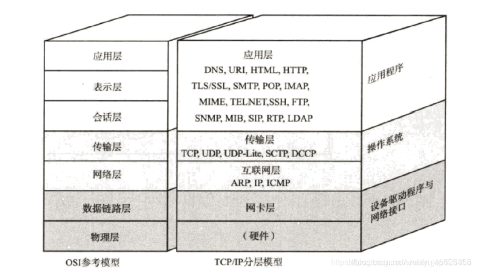

- 第一层 (物理层)： 是以0 101的二进制数据进行发送到网络其他设备中的。
- 第二层 (数据链路层)： 实现网络互联，连接到不同的主机，不同主机之间还要进行数据传输。
- 第三层 (网络层)： 网络地址IP使用，通过路由器传送到对应的地方。
- 第四层 (传输层)： TCP/UDP协议：都是属于操作系统。
- 第五层 (会话层)： 通信管理，负责建立和断开通信连接。
- 第六层 (表示层)： 主要是应用程序的沟通，包括FTP文件传输协议等。

​	**七层模型在落地时第五层（会话层）和第六层（表示层）实现不了，它既复杂又不实用; 所以我们按照TCP/IP五层模型来讲解。
OSI七层模型去掉会话层和表示层就成为TCP/IP的五层模型了。**


## 2.TCP五层网络分层模型


### **1.TCP/IP五层模型表格**

TCP/IP通讯协议采用了5层的层级结构，每一层都呼叫它的下一层所提供的网络来完成自己的需求。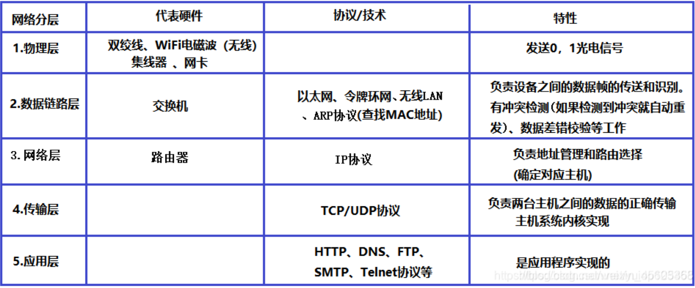

1. **物理层**：负责光/电信号的传递方式。 比如现在以太网通用的网线(双绞 线)、早期以太网采用的的同轴电缆(现在主要用于有线电视)、光纤, 现在的wifi无线网使用电磁波等都属于物理层的概念。物理层的能力决定了最大传输速率、传输距离、抗干扰性等. 集线器(Hub)工作在物理层。
2. **数据链路层**： 负责设备之间的数据帧的传送和识别.。例如网卡设备的驱动、帧同步(就是说从网线上检测到什么信号算作新帧的开始)、冲突检测(如果检测到冲突就自动重发)、数据差错校验等工作. 有以太网、令牌环网, 无线LAN等标准. 交换机(Switch)工作在数据链路层。
3. **网络层**：负责地址管理和路由选择. 例如在IP协议中, 通过IP地址来标识一台主机, 并通过路由器的方式规划出两台主机之间的数据传输的线路(路由). 路由器(Router)工作在网路层.
4. **传输层**： 负责两台主机之间的数据传输. 如传输控制协议 (TCP), 能够确保数据可靠的从源主机发送到目标主机.
5. **应用层**： 负责应用程序间沟通，如简单电子邮件传输（SMTP）、文件传输协议（FTP）、网络远程访问协议（Telnet）等.。我们的网络编程主要就是针对应用层。


### 2.各层代表硬件

1. 对于一台主机, 它的操作系统内核实现了从传输层到物理层的内容；如果主机是应用层，七层模型都可以进行数据解析/格式化。
2. 对于一台路由器, 它实现了从网络层到物理层；网络层以内的所有层都可以解析数据/格式化（物理层、数据链路层、网络层）。
3. 对于一台交换机, 它实现了从数据链路层到物理层；交换机在真实数据上不会进行数据包装而是直接发送，而路由器则会将数据链路层的数据帧进行包装。
4. 对于集线器, 它只实现了物理层;作用只是转发数据


### 3.各种协议：

- **IP协议**： 定位网络中某一台主机。在网络层包装IP地址。
- **HTTP协议**: 网络通信协议(文本传输协议)
- **FTP协议**: 文件上传协议
- **SMTP协议**: 发送邮件协议
- **DNS协议**: 域名解析协议
- **Telnet协议**： 网络远程访问协议
- **ARP协议**： 建立IP地址与MAC地址的映射。
- **TCP/UDP协议**： 传输控制协议


### 4.MAC地址、IP地址、Port端口号

#### 1.IP地址

- 为互联网中的每一个网络和每一台主机分配一个逻辑地址，来和物理地址区分。
- 在网络中唯一标识一台主机，保证了用户在连网的计算机上操作时，能够高效而且方便地从千千万万台计算机中选出自己所需的对象来。IP地址的表示：
- 我们通常也使用 “点分十进制” 的字符串表示IP地址, 例如 192.168.0.1 ; 用点分割的每一个数字表示一个字节, 范围是 0 - 255;
- IP地址分类： IPV4/IPV6
  IPv4采用32位地址长度，只有大约43亿个地址，而IPv6采用128位地址长度，几乎可以不受限制地提供地址


#### .MAC地址：

- MAC地址用来识别数据链路层中相连的节点，硬件设备来找主机是通过MAC地址来找的。
- 长度为48位, 及6个字节. 一般用16进制数字加上冒号的形式来表示(例如: 08:00:27:03:fb:19)
- 在网卡出厂时MAC地址就确定了, 不能修改. mac地址通常是唯一的(虚拟机中的mac地址不是真实的mac地址, 可能会冲突; 也有些网卡支持用户配置mac地址)


#### 3.Port端口号：

- 端口号(port)是传输层协议的内容，端口号是一个32位的整数;
- 端口号用来标识一个进程, 告诉操作系统, 当前的这个数据要交给哪一个进程来处理;
- 一个进程可以绑定多个端口号; 但是一个端口号不能被多个进程绑定;
- 端口号范围：
  - 0-1023:知名端口号, HTTP, FTP, SSH等这些广为使用的应用层协议,他们的端口号都是固定的.
  - 1024- 65535:操作系统动态分配的端口号.客户端程序的端口号,就是由操作系统从这个范围分配的.
- 认识知名端口号(Well-Know Port Number)
  有些服务器是非常常用的, 为了使用方便, 人们约定一些常用的服务器, 都是用以下这些固定的端口号,我们自己写一个程序使用端口号时, 要避开这些知名端口号:
  - ssh服务器, 使用22端口
  - ftp服务器, 使用21端口
  - telnet服务器, 使用23端口
  - http服务器, 使用80端口
  - https服务器, 使用443

**IP地址 + 端口号能够标识网络上的某一台主机的某一个进程;**


### 5.大白话总结TCP/IP协议（便于理解但没有专业知识）

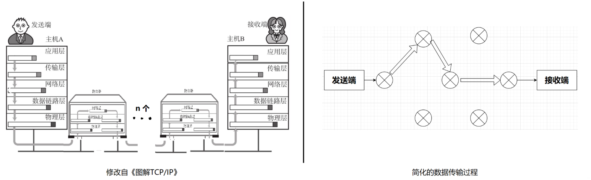

​	看上面的图，发送端想要发送数据到接收端。首先**应用层准备好要发送的数据**，然后给了传输层，**传输层的主要作用就是为发送端和接收端提供可靠的连接服务**，传输层将数据处理完后就给了网络层。网络层的功能就是管理网络，其中一个核心的功能就是路径的选择(路由器)，从发送端到接收端有很多条路，**网络层就负责管理下一步数据应该到哪个路由器**。选择好了路径之后，数据就来到了数据链路层，**链路层就是负责将数据从一个路由器送到另一个路由器**。然后就是物理层了，可以简单的理解，**物理层就是网线一类的最基础的设备。**	

​	例子解释以上的协议：

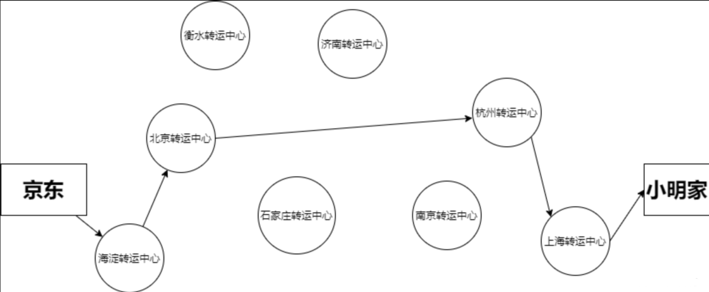

​	小明住在上海市长江路幸福小区5#666，现在小明在京东上面买了一部小米10Pro。京东在接到小米的订单后，工作人员从仓库中找到一部小米10Pro**（应用层）**。工作人员将手机打包好， 交给了京东物流**（传输层）**。接下来手机就到了转运中心（路由器），转运中心根据时间，成本等一系列因素决定下一步该发往哪一个转运中心**(网络层)**。决定好接下来发往哪一个转运中心后就开始用货车运输了，那么运输的过程就是**数据链路层**了，链路层负责将数据从一个端点送到另一个端点。那么货车行驶的道路就是**物理层**。几经周转，手机安全地送到了小明手上。


### 6.详细解释各层的含义

#### 1.应用层

##### 1.1 应用层的作用

1. **数据格式化和表示**：应用层协议定义了数据的格式。例如，HTTP协议规定了如何在客户端（如浏览器）和服务器之间发送和接收网页内容。
2. **与用户交互**：应用层直接面向用户，负责处理用户的请求。例如，当用户在浏览器中输入一个URL时，浏览器通过HTTP协议请求服务器获取该网页的数据。
3. **应用服务**：应用层提供特定的服务，如文件传输、邮件服务、远程登录等。例如，HTTP用于网页浏览，FTP用于文件传输，SMTP用于邮件发送等。


##### 1.2 HTTP 在应用层的工作方式

1. **请求和响应模型**：HTTP使用请求和响应模型，客户端发送请求，服务器返回响应。每个HTTP请求包含请求行、头部信息、空行和可选的请求体；响应包含状态行、头部信息、空行和响应体。
2. **数据传输格式**：应用层规定了传输数据的格式，如HTML、JSON、XML等格式在HTTP中被使用。它们定义了数据在传输中的表示方式。
3. **状态管理**：HTTP协议支持状态码和头部字段，帮助客户端理解服务器的响应。例如，`200 OK`表示请求成功，`404 Not Found`表示资源未找到。


##### 1.3 其他应用层协议

除了HTTP，应用层还有许多其他协议，如：

- **FTP (File Transfer Protocol)**：用于文件传输。
- **SMTP (Simple Mail Transfer Protocol)**：用于邮件发送。
- **DNS (Domain Name System)**：用于域名解析。


#### 2.传输层

​	传输层是网络协议栈中位于应用层下面的关键层，负责在两台设备之间提供可靠的数据传输。它的主要任务是确保数据从一端正确无误地传送到另一端，即使网络环境复杂多变。传输层最常用的协议有TCP（传输控制协议）和UDP（用户数据报协议）。


##### 1.1 传输层的主要功能

1. **数据分割和重组**：传输层将应用层的大块数据分割成更小的片段（称为数据包），然后将这些数据包传输到接收方。接收方的传输层会将这些小片段重新组装成完整的数据，交给应用层。
2. **错误检测与校正**：传输层会检测数据在传输过程中是否出错，如果发现错误，可以请求重传。
3. **流量控制**：控制数据传输的速度，避免发送方的数据传输速度过快，导致接收方处理不过来。
4. **连接管理**：传输层可以在两台设备之间建立、管理和终止连接，以确保数据的有序传输（TCP协议）。


##### 1.2 传输层中的主要协议

###### 1.2.1TCP（传输控制协议）

TCP是一种面向连接的协议，提供可靠的、顺序的数据传输。它确保数据包按顺序到达，并且没有丢失。

- **连接建立**：TCP在数据传输前会建立一个连接（三次握手），确保双方准备好传输数据。
- **可靠传输**：TCP会确认每个数据包的接收情况，丢失的数据包会被重新发送。
- **流量控制**：TCP调节数据传输速率，防止网络拥塞。
- **断开连接**：数据传输结束后，TCP会关闭连接（四次挥手）。

**举例**：TCP适用于需要数据完整性的场景，如网页浏览、文件下载、邮件传输等。


###### 1.2.2UDP（用户数据报协议）

UDP是一种无连接的协议，不提供可靠的数据传输服务。它直接将数据包发送给对方，不确认是否收到或按顺序接收。

- **快速传输**：UDP不建立连接，传输速度快，但不保证数据的可靠性和顺序性。
- **简单且高效**：由于没有复杂的连接管理和错误处理，UDP在对速度要求较高、偶尔丢失数据不影响使用的场合中被广泛使用。

**举例**：UDP适用于实时性要求高的场景，如视频会议、在线游戏、直播等。


# 二、使用socket进行TCP/IP通讯

## 1.python实现

### 1.1 服务、客户双python代码实现

下列放上验证代码，先运行服务端创建服务器之后再运行客户端便可以接收到来自客户端的消息：

**服务端：**

```
# 示例一:
import socket

def tcp_server():
    host = '127.0.0.1'  # 服务器地址，本地环回地址
    port = 65432         # 端口号

    # 创建 TCP/IP 套接字
    with socket.socket(socket.AF_INET, socket.SOCK_STREAM) as s:
        s.bind((host, port))  # 绑定地址
        s.listen()            # 开始监听，等待客户端连接
        print("Server is listening...")

        conn, addr = s.accept()  # 接受客户端连接
        with conn:
            print(f"Connected by {addr}")
            while True:
                data = conn.recv(1024)  # 接收数据
                if not data:
                    break
                print(f"Received: {data.decode()}")  # 打印接收到的数据
                conn.sendall(data)  # 将接收到的数据发送回客户端

if __name__ == '__main__':
    tcp_server()
    
    
    
# 示例2：
import socket
from socket import socket, AF_INET, SOCK_STREAM
import time 
HOST = ""  # HOST 变量是空白的，表示它可以使用任何可用的地址。
PORT = 21567
BUFSIZ = 1024
ADDR = (HOST, PORT)

tcpSerSock = socket(family=AF_INET, type=SOCK_STREAM)
tcpSerSock.bind(ADDR)
tcpSerSock.listen(5)  # 开始TCP监听,监听5个请求

while True:
    print("waiting for connection...")
    tcpCliSock, addr = tcpSerSock.accept() # 采用阻塞模式，等待客户端连接（若客户未连接则会卡在这行代码上）
    print(f"... connected form: {addr}") # 若客户端连接成功，则通过f-string的方式打印客户端地址
    while True:
        data = tcpCliSock.recv(BUFSIZ) # 接收客户端发送的数据
        if not data: # 如果没有数据，则退出循环
            break
        tcpCliSock.send(bytes('[{}]: {}'.format(time.time(), data), 'utf-8')) # 将接收到的数据发送回客户端
    tcpCliSock.close()
```


**客户端：**

```
# 示例1：
import socket

def tcp_client():
    host = '127.0.0.1'  # 服务器地址
    port = 65432         # 端口号

    # 创建 TCP/IP 套接字
    with socket.socket(socket.AF_INET, socket.SOCK_STREAM) as s:
        s.connect((host, port))  # 连接到服务器
        message = "Hello from Client"
        print(f"Sending: {message}")
        s.sendall(message.encode())  # 发送数据

        data = s.recv(1024)  # 接收服务器回传的数据
        print(f"Received back: {data.decode()}")  # 打印服务器回传的数据

if __name__ == '__main__':
    tcp_client()
    
    
示例2：
import socket
from socket import socket, AF_INET, SOCK_STREAM
import time 

HOST = '127.0.0.1'  # or 127.0.0.1
PORT = 21567   # 端口一定要一样
BUFSIZ = 1024
ADDR = (HOST, PORT)# 服务器地址和端口

tcpCliSock = socket(AF_INET, SOCK_STREAM) # 创建客户端套接字
tcpCliSock.connect(ADDR) # 尝试连接服务器，若未连接成功则会一直等待

while True:
    data = input('> ') # 输入数据
    if not data: # 如果数据为空，则退出循环
        break
    tcpCliSock.send(bytes(data, 'utf-8')) # 发送数据
    data = tcpCliSock.recv(BUFSIZ) # 接收数据
    if not data:
        break
    print(data.decode('utf-8')) # 打印接收到的数据
tcpCliSock.close() # 关闭套接字
```

最后的效果如下所示：

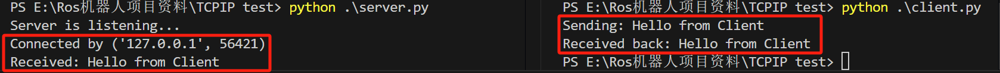


#### 1.1.1 socket模块

|     **socket**类型      |                             描述                             |
| :---------------------: | :----------------------------------------------------------: |
|    `socket.AF_UNIX`     |              只能够用于单一的Unix系统进程间通信              |
|    `socket.AF_INET`     |          服务器之间网络通信，表示使用 IPv4 地址族。          |
|    `socket.AF_INET6`    |                             IPv6                             |
|  `socket.SOCK_STREAM`   |                   流式socket , for **TCP**                   |
|   `socket.SOCK_DGRAM`   |                 数据报式socket , for **UDP**                 |
|    `socket.SOCK_RAW`    | 原始套接字，普通的套接字无法处理ICMP、IGMP等网络报文，而SOCK_RAW可以；其次，SOCK_RAW也可以处理特殊的IPv4报文；此外，利用原始套接字，可以通过IP_HDRINCL套接字选项由用户构造IP头。 |
| `socket.SOCK_SEQPACKET` |                     可靠的连续数据包服务                     |
|     创建TCP Socket      |     `s=socket.socket(socket.AF_INET,socket.SOCK_STREAM)`     |
|     创建UDP Socket      |     `s=socket.socket(socket.AF_INET,socket.SOCK_DGRAM)`      |


#### 1.1.2 Socket 函数

注意点：

- TCP发送数据时，已建立好TCP连接，所以不需要指定地址。UDP是面向无连接的， 每次发送要指定是发给谁。
- 服务端与客户端不能直接发送列表，元组，字典。需要字符串化repr(data)。

服务端socket函数：

|     socket函数      |                             描述                             |
| :-----------------: | :----------------------------------------------------------: |
|  `s.bind(address)`  | 将套接字绑定到地址, 在AF_INET下,以元组（host,port） 的形式表示地址. |
| `s.listen(backlog)` | 开始监听TCP传入连接。backlog指定在拒绝连接之前，操作 系统可以挂起的最大连接数量。该值至少为1，大部分应用程 序设为5就可以了。 |
|    `s.accept()`     | 接受TCP连接并返回（conn,address）,其中conn是新的套 接字对象，可以用来接收和发送数据。address是连接客户 端的地址。 |


客户端socket函数：

|        socket函数        |                             描述                             |
| :----------------------: | :----------------------------------------------------------: |
|   `s.connect(address)`   | 连接到address处的套接字。一般address的格式为元组（hostname,port），如果连接出错，返回socket.error错误。 |
| `s.connect_ex(adddress)` | 功能与connect(address)相同，但是成功返回0，失败返回error的值。 |


公共socket函数：

|               socket函数               |                             描述                             |
| :------------------------------------: | :----------------------------------------------------------: |
|        `s.recv(bufsize[,flag])`        | 接受TCP套接字的数据。数据以字符串形式返回，bufsize指定要接收的最大数据量。flag提供有关消息的其他信息，通常可以忽略。 |
|        `s.send(string[,flag])`         | 发送TCP数据。将string中的数据发送到连接的套接字。返回值是要 收的最大数据量。flag提供有关消发送的字节数量，该数量可能小于 息的其他信息，通常可以忽略。 |
|       `s.sendall(string[,flag])`       | 完整发送TCP数据。将string中的数据发送到连接的套接字，但在返回之前会尝试发送所有数据。成功返回None，失败则抛出异常。 |
|      `s.recvfrom(bufsize[.flag])`      | 接受UDP套接字的数据。与recv()类似，但返回值是（data,address）。其中data是包含接收数据的字符串，address是发送数据的套接字地址。 |
|   `s.sendto(string[,flag],address)`    | 发送UDP数据。将数据发送到套接字，address是形式为（ipaddr，port）的元组，指定远程地址。返回值是发送的字节数。 |
|              `s.close()`               |                         关闭套接字。                         |
|           `s.getpeername()`            | 返回连接套接字的远程地址。返回值通常是元组（ipaddr,port）。  |
|           `s.getsockname()`            |      返回套接字自己的地址。通常是一个元组(ipaddr,port)       |
|  `s.setsockopt(level,optname,value)`   |                   设置给定套接字选项的值。                   |
| `s.getsockopt(level,optname[.buflen])` |                   设置给定套接字选项的值。                   |
|        `s.settimeout(timeout)`         | 设置套接字操作的超时期，timeout是一个浮点数，单位是秒。值为None表示没有超时期。一般，超时期应该在刚创建套接字时设置，因为它们可能用于连接的操作（如connect()） |
|            `s.gettimeout()`            | 返回当前超时期的值，单位是秒，如果没有设置超时期，则返回None。 |
|              `s.fileno()`              |                   返回套接字的文件描述符。                   |
|         `s.setblocking(flag)`          | 如果flag为0，则将套接字设为非阻塞模式，否则将套接字设为阻塞模式（默认值）。非阻塞模式下，如果调用recv()没有发现任何数据，或send()调用无法立即发送数据，那么将引起socket.error异常。 |
|             `s.makefile()`             |                创建一个与该套接字相关连的文件                |


3、socket 编程
TCP服务端：

1.创建套接字，绑定套接字到本地IP与端口

```
socket.socket(socket.AF_INET,socket.SOCK_STREAM) , s.bind()
```

2.开始监听连接 

```
s.listen()
```

3.进入循环，不断接受客户端的连接请求 

```
s.accept()
```

4.然后接收传来的数据，并发送给对方数据 

```
s.recv() , s.sendall()
```

5.传输完毕后，关闭套接字 

```
s.close()
```


TCP客户端:

1.创建套接字，连接远端地址

```
socket.socket(socket.AF_INET,socket.SOCK_STREAM) , s.connect()
```

2.连接后发送数据和接收数据

```
s.sendall(), s.recv()
```

3.传输完毕后，关闭套接字 

```
s.close()
```


# 三、通过socket与阿里云服务器进行传输数据

## 3.1 创建阿里云服务器

### 3.1.1 初始化服务器

1 进入免费领取ECS（云服务器）网址：[阿里云免费试用 - 阿里云 (aliyun.com)](https://free.aliyun.com/?spm=5176.19720258.J_2937333540.11.e9392c4a6d5rqN&scm=20140722.3079.7.2925)（其中具体创建的服务器类型按照自己想要的选择即可，我这里选择的是性能最弱也是最便宜的服务器，**这里可能会要你安装什么应用啥的，可以安装宝塔的，其他无所谓，不影响后面操作**）

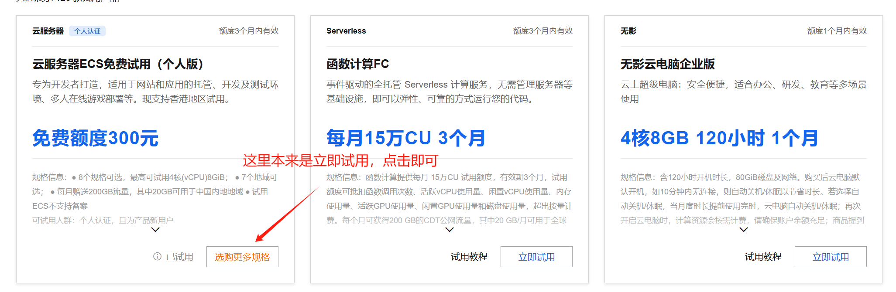

2 进入控制台，查看ECS服务器

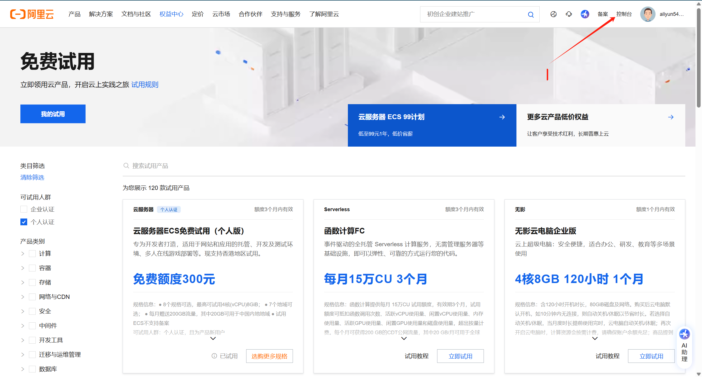

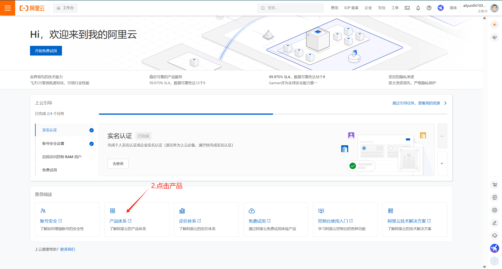


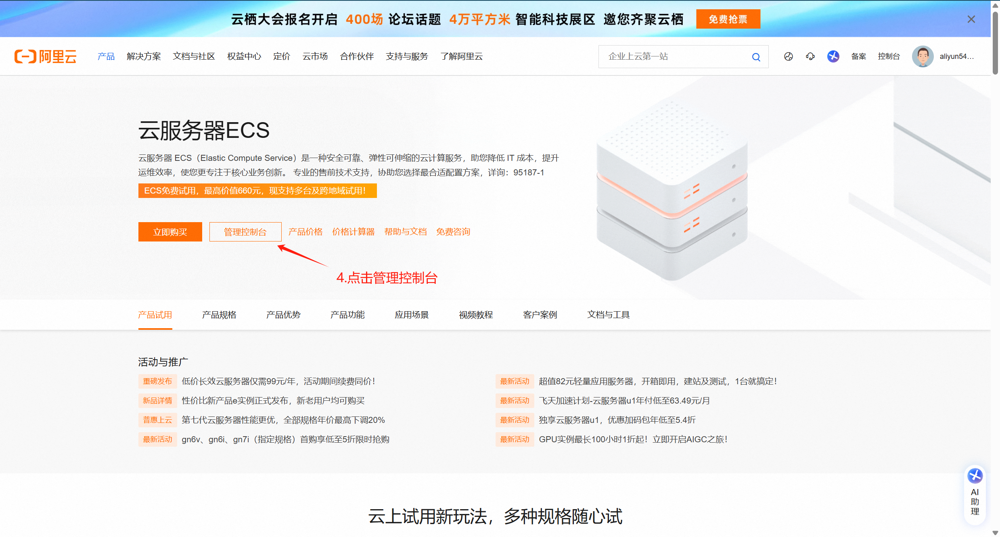

3 重置实例密码（可以理解为重置登陆账户的密码）

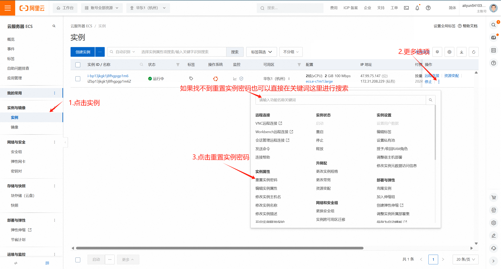

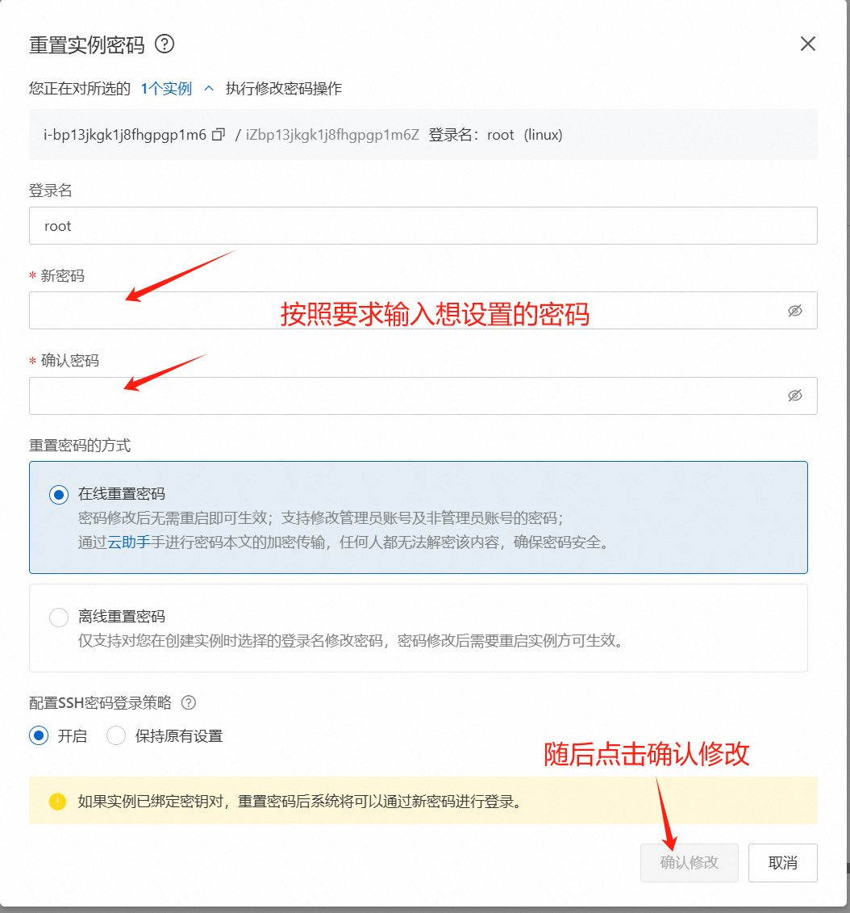


### 3.1.2 配置需要使用的端口

#### 1 打开安全组中的管理规则，创建需要使用的端口

（其中TCP 22/22 端口就是我们一般使用的远程连接使用的端口）

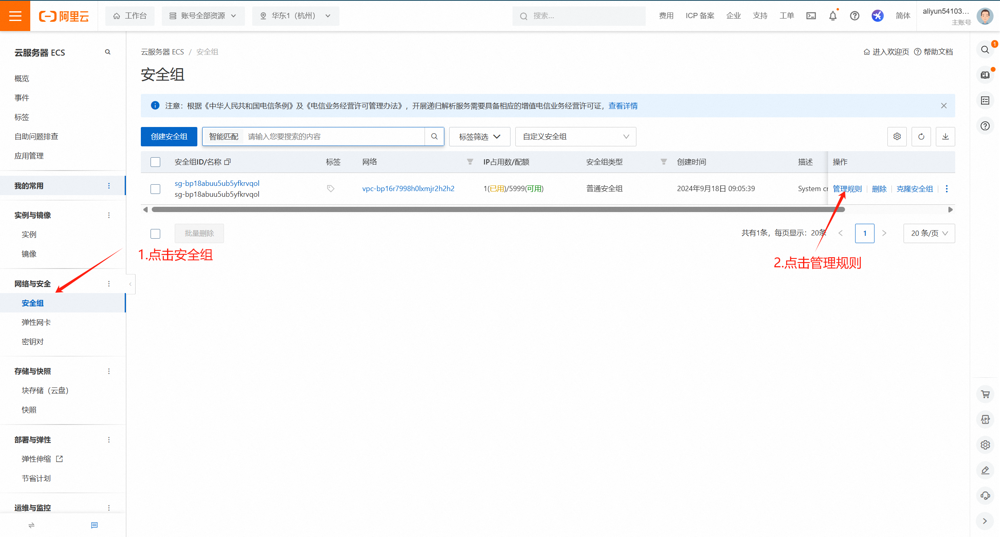

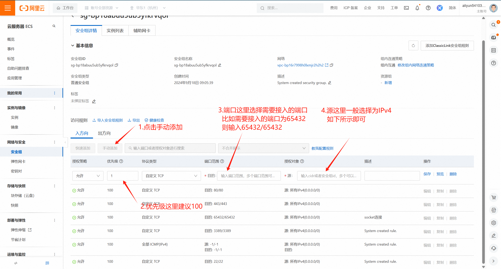


#### 2 远程连接（xshell、putty皆可）

​	远程连接比较简单，就通过实例的**IP公网地址（这里就是上面的47.99.75.147）**进行连接即可（我把公网ip告诉大家了，球球大家不要攻击我的服务器，球球辣）。

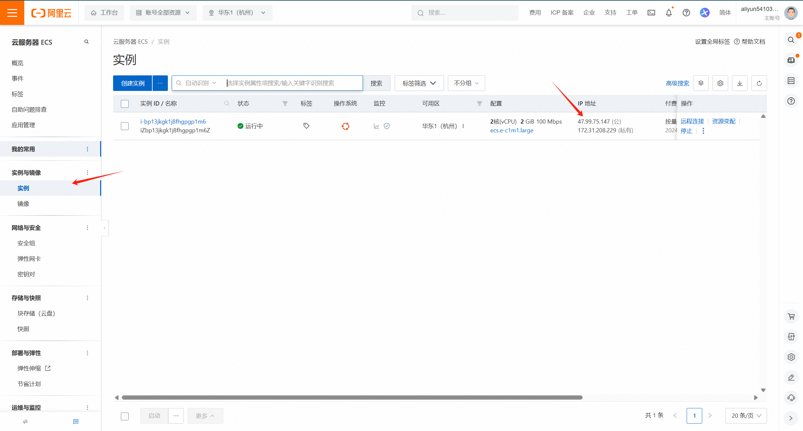


#### 3 进行服务器的服务端配置

​	进入服务端之后首先打开我们端口的tcp（这里是通过防火墙打开的，因为服务器默认有防火墙会阻止外接连接端口，所以需要通过防火墙插件ufw进行许可）：

```
sudo ufw allow 65432 # 允许开启端口号
sudo ufw allow 65432/tcp # 允许打开端口tcp服务

# 相反如果要禁用某端口tcp服务则可以执行以下指令
sudo ufw deny 65432 # 禁用端口号
sudo ufw deny 65432/tcp # 禁用该端口tcp服务
```

​	

​	验证，输入指令查看防火墙状态，看看前面指令允许端口号打开有没有成功，若显示下图则说明配置成功了：

```
sudo ufw status 
```

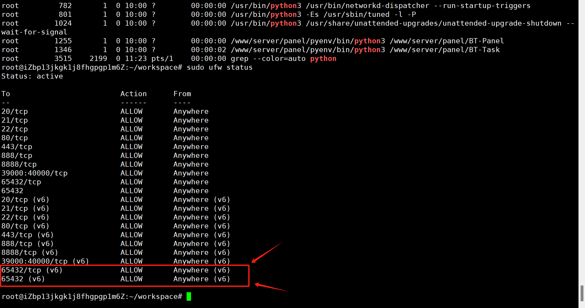

​	配置成功之后就可以通过TCP（socket）远程进行传输数据了。


#### 4 代码编写

​	服务器服务端代码：

```
import socket

def tcp_server():
    host = '0.0.0.0'  # 服务器地址，本地环回地址
    port = 65432         # 端口号

    # 创建 TCP/IP 套接字
    # 下面这个操作其实等效于 s = socket.socket(socket.AF_INET, socket.SOCK_STREAM)
    with socket.socket(socket.AF_INET, socket.SOCK_STREAM) as s:
        s.bind((host, port))  # 绑定地址和端口
        s.listen()            # 开始监听，等待客户端连接
        print("Server is listening...")

        conn, addr = s.accept()  # 接受客户端连接
        with conn:
            print(f"Connected by {addr}")
            while True:
                data = conn.recv(1024)  # 接收数据
                if not data:
                    break
                print(f"Received: {data.decode()}")  # 打印接收到的数据
                conn.sendall(data)  # 将接收到的数据发送回客户端

if __name__ == '__main__':
    tcp_server()
```


​	客户端代码：

```
import socket

def tcp_client():
    host = '47.99.75.147'  # 服务器地址
    port = 65432         # 端口号

    # 创建 TCP/IP 套接字
    with socket.socket(socket.AF_INET, socket.SOCK_STREAM) as s:
        s.connect((host, port))  # 连接到服务器
        message = "Hello from Client"
        print(f"Sending: {message}")
        s.sendall(message.encode())  # 发送数据

        data = s.recv(1024)  # 接收服务器回传的数据
        print(f"Received back: {data.decode()}")  # 打印服务器回传的数据

if __name__ == '__main__':
    tcp_client()
```


在服务器中安装python3：

```
sudo apt install python3
```

​    

安装完毕之后通过vim创建 **文件名.py** 之后通过 python3 文件名.py 运行文件即可。（如果不会创建的话建议学下vim使用流程）


 **最后效果如下（左侧是远程连接服务器，右侧是在本地windows下执行的python代码）：**

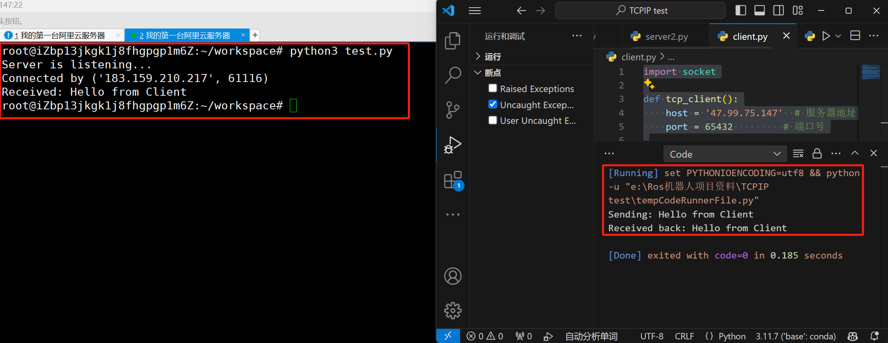


#### 5 报错解决

1 若出现报错 OSError: [Errno 98] Address already in use，说明端口被占用，执行以下指令：

```
# 显示当前端口进程情况，例如grep 65432，若执行之后显示了任务（正常是执行之后什么都不显示）
sudo netstat -tuln | grep 端口号  

# 找到端口进程ID 
sudo lsof -i :端口号 # 例如sudo lsof -i :65432

# 找到进程 ID 后，使用 kill 命令终止进程
kill -9 pid    #pid是指进程的ID号( 端口号)，kill -9 用来强制杀死进程

ps -fA | grep python  #查看在运行中的端口程序，这个时候会发现已经没有程序占用该端口了
```

