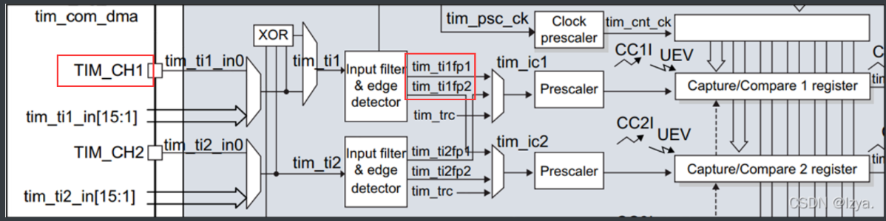

## 1.串口那些事

### 1.1 串口重定向代码

**（用于配置直接使用`printf`串口输出，魔术棒勾上`Use MicroLIB`）**

**还需要在usart.c中添加`#include <stdio.h>`防止`printf`无法识别**

```
#include <stdio.h>

int fputc(int ch, FILE *f)
{
  HAL_UART_Transmit(&huart1, (uint8_t *)&ch, 1, 0xffff);
  return ch;
}

int fgetc(FILE *f)
{
  uint8_t ch = 0;
  HAL_UART_Receive(&huart1, &ch, 1, 0xffff);
  return ch;
}

```


### 1.2 串口中断接收数据（cubemx版本）

**首先先是按照上侧给串口进行重定向。**


**在这里要选择一下串口的全局中断，这样不管什么时候只要有数据输入，那么串口就会自动中断。**

**随后在main函数中添加串口接受使能中断函数：**

```
HAL_UART_Receive_IT(&huart1,&RecieveBuffer,1); //使能接收中断,RecieveBuffer的类型是uint8_t
!!注意这个代码是接受中断的初始化必须放在main函数里面。
```

**上侧是初始化一个字节的，如果你输入是超过一个字节的内容就可以改变函数最后面的数字，比如如果要输出hello就可以把1改为10。**

**随后再在main中重写一下串口接收中断回调函数：**

```
void HAL_UART_RxCpltCallback(UART_HandleTypeDef *huart)
{
	UNUSED(huart);
	HAL_UART_Transmit_IT(&huart1,&RecieveBuffer,1); // 将接收到的数据再通过串口发送出去
}
!!注意这个代码是函数的定义必须放在main函数外面。
```

**同样，如果需要发送出来更多字节数据可以把发送函数后面的1改为5之类更大的数（但是这里有个前提就是其中间的接收缓冲变量必须是一个uint8_t [x]类型的）。**

**

```
例如:**

**uint8_t recive_buff[12] = {0}；**

**HAL_UART_Receive_IT(&huart1,recive_buff,12); // 将接收到的数据再通过串口发送出去**

**！！！这样便会接收中断且接收12个字节，而不是单纯的1个字节了，但是需要注意的是这样子接收就是必须接受到12个字符才会进入串口中断接收的回调函数中，若未达到12个字节则不会进入串口接收中断。**


```


### 1.3 正点原子的串口接收办法（移植到cubemx中）

#### 1.3.1 配置流程

记得先开启串口全局中断！！！！！！！！！！


写的非常完美，在回调函数中巧妙通过换行符来确定一个字符串的结束，并且把一整个字符串存入预先设置好的数组当中去。并且设置好了各个标志位，这样在别的函数中便可通过这个标志位来判断字符串接收的情况。以下函数写在usart.c中。

```
uint16_t USART_RX_STA=0;       //接收状态标记	  
uint8_t aRxBuffer[RXBUFFERSIZE];//HAL库使用的串口接收缓冲
uint8_t USART_RX_BUF[USART_REC_LEN];     //接收缓冲,最大USART_REC_LEN个字节.
uint8_t len;
uint16_t times;

//回调函数，通过一个回调函数将一次传输的字符串存入USART_RX_BUF（通过最后的换行符来确定是否接收完全一个字符串。）
void HAL_UART_RxCpltCallback(UART_HandleTypeDef *huart)
{
	if(huart->Instance==USART1)//如果是串口1
	{
		if((USART_RX_STA&0x8000)==0)//接收未完成,15位是否等于0，等于0未完成，等于1就是接收完成。
		{
			if(USART_RX_STA&0x4000)//接收到了0x0d（即回车键）
			{
				if(aRxBuffer[0]!=0x0a)//接收到的不是0x0a（即不是换行键）
				{
					USART_RX_STA=0;//接收错误,重新开始
				}
				else 
				{
					USART_RX_STA|=0x8000;	//接收完成了
				}					
			}
			else //还没收到0X0D（即回车键）
			{	
				if(aRxBuffer[0]==0x0d)//如果收到回车
					USART_RX_STA|=0x4000;//就把回车标志位设置为1
				else
				{
					USART_RX_BUF[USART_RX_STA&0X3FFF]=aRxBuffer[0] ;
					USART_RX_STA++;//计算收到字节数量
					if(USART_RX_STA>(USART_REC_LEN-1))//收到数量大于199，就是超出设置的额度
						USART_RX_STA=0;//接收数据错误,重新开始接收	  
				}		 
			}
		}
	}
}
```

在usart.h中添加一些上侧用到的定义量：

```
#define USART_REC_LEN  			200  		//定义最大接收字节数 200
#define EN_USART1_RX 			1			//使能（1）/禁止（0）串口1接收
#define RXBUFFERSIZE   1 					//缓存大小
```

随后还需要重写**void USART1_IRQHandler(void)**函数，此函数定义在cubemx文件中的stm32fxxx.it.c文件中，需要进入stm32fxxx.it.c文件将此函数修改成以下函数：

```
void USART1_IRQHandler(void)
{
  	uint32_t timeout=0;
#if SYSTEM_SUPPORT_OS	 	//使用OS
	OSIntEnter();    
#endif
	
	HAL_UART_IRQHandler(&huart1);	//调用HAL库中断处理公用函数，会清除中断使能
	
	timeout=0;
    while (HAL_UART_GetState(&huart1) != HAL_UART_STATE_READY)//等待就绪
	{
	 timeout++;////超时处理
     if(timeout>HAL_MAX_DELAY) break;
	
	}
     
	timeout=0;
	while(HAL_UART_Receive_IT(&huart1, (uint8_t *)aRxBuffer, RXBUFFERSIZE) != HAL_OK)//一次处理完成之后，重新开启中断并设置RxXferCount为1
	{
	 timeout++; //超时处理
	 if(timeout>HAL_MAX_DELAY) break;	
	}
#if SYSTEM_SUPPORT_OS	 	//使用OS
	OSIntExit();  											 
#endif
}
```

​	修改完以上两个函数中记得把定义的一些变量extern到需要的文档中，还有就是在stmfxxx.it.c文件中包含进usart.h头文件，这样便可以完成正点原子完美串口接收的代码。

​	在主函数中，想要利用上面回调函数的结果只需要做以下操作便可实现想要的功能：

```
// 记住开始之前一定要使能
HAL_UART_Receive_IT(&huart1, (uint8_t *)aRxBuffer, RXBUFFERSIZE);//该函数会开启接收中断：标志位UART_IT_RXNE，并且设置接收缓冲以及接收缓冲接收最大数据量
if(USART_RX_STA&0x8000)           //判断bit15是否为1，是1就是成功接收到了数据
 {	
    len=USART_RX_STA&0x3fff;//得到此次接收到的数据长度，取bit0~13的有效数据位
    printf("\r\n您发送的消息为:\r\n");
    HAL_UART_Transmit(&huart1,(uint8_t*)USART_RX_BUF,len,1000);	//发送接收到的数据
    while(__HAL_UART_GET_FLAG(&huart1,UART_FLAG_TC)!=SET);		//等待发送结束
    printf("\r\n\r\n");//插入换行
    USART_RX_STA=0;
 }
else
 {
	times++;
	if(times%5000==0)
 {
	printf("\r\nALIENTEK 战舰STM32开发板	 串口实验\r\n");
	printf("正点原子@ALIENTEK\r\n\r\n\r\n");
 }
	if(times%200==0)printf("请输入数据,以回车键结束\r\n");  
	HAL_Delay(10); 
 }
```

#### 1.3.2串口接收数据处理办法

##### 1 字符型转整数型

这里加一个将正点原子接收到的数字从**char型转化到int型**的方式：

```
	//后面用到的atoi函数需要用到stdlib库
	#include <stdlib.h>
	//以下是示例程序，receive_data就是将串口中的数字字符串转为数字的变量。
    if(USART_RX_STA&0x8000)           //判断bit15是否为1，是1就是成功接收到了数据
	{	
        len=USART_RX_STA&0x3fff;//得到此次接收到的数据长度，取bit0~13的有效数据位
        USART_RX_BUF[len] = '\0'; // 将接收到的数据转换为以null结尾的字符串
        receive_data = atoi((char*)USART_RX_BUF); // 将接收到的字符串转换为整数
        printf("\r\n\r\n");//插入换行
        USART_RX_STA=0;
	}
    printf("%d" ,receive_data);
    HAL_Delay(500);
```

##### 2 判断串口接收数据进行功能实现

**1.检测数据最后一位**

```
		if(USART_RX_STA&0x8000)           //判断bit15是否为1，是1就是成功接收到了数据
		{	
			len=USART_RX_STA&0x3fff;//得到此次接收到的数据长度，取bit0~13的有效数据位
			HAL_UART_Transmit(&huart1,(uint8_t*)(USART_RX_BUF + len - 1), 1  ,1000);	//发送接收到的数据
			while(__HAL_UART_GET_FLAG(&huart1,UART_FLAG_TC)!=SET);		//等待发送结束
			if (*(USART_RX_BUF + len - 1) == '1') 
			{
				control_of_water = 1;//设置为手动控制水泵模式
				HAL_GPIO_WritePin(GPIOB , GPIO_PIN_4 , GPIO_PIN_SET);//并且开启水泵
			}
			if (*(USART_RX_BUF + len - 1) == '2') 
			{
				control_of_water = 1;//设置为手动控制水泵模式
				HAL_GPIO_WritePin(GPIOB , GPIO_PIN_4 , GPIO_PIN_RESET);//并且关闭水泵
			}
			if (*(USART_RX_BUF + len - 1) == '3') 
			{
				control_of_water = 0;//设置为自动检测后控制水泵模式
				HAL_GPIO_WritePin(GPIOB , GPIO_PIN_4 , GPIO_PIN_RESET);//并且关闭水泵
			}
			USART_RX_STA=0;
		}
```

​	显然要检测接收到完整数据的最后一位最好的方法就是将接收到的字符串组的**首地址 + 字符串长度 - 1**就是字符串最后一个字符。再将这个字符和想要设置的特殊字符进行比较就可以实现相应的功能了。


##### 3 将各种类型的变量转为字符串型

要想在字符串和各种变量之间进行灵活转换要用到的是**#include "string.h"**这个头文件：

**（1）：sprintf函数**

这个函数可以称为最牛函数，可以将任何类型的变量转为字符串，一般有以下几种用法：

```
char b[200];
float c = 2.6236;
sprintf(b, "Voltage: %.2f", c);
LCD_DisplayStringLine(Line2, (unsigned char *)b);//这里是采用蓝桥杯LCD显示代码
这种操作做出的效果就是显示Voltage: 2.62
```


## 2.**定时器中断需添加代码**

### **2.1  开启定时器内部中断**


按照上面的配置完成之后一个内部定时器功能就完成了。

```
 /* USER CODE BEGIN 2 */
	HAL_TIM_Base_Start_IT(&htim3);//开启定时器3中断（这里在cubemx中要添加global interrupt 即全局中断）
  /* USER CODE END 2 */
```

**主函数中加回调函数**

**(若是在main函数下面写的回调函数则需在其上面声明)**

```
`/* USER CODE BEGIN 4 */
void HAL_TIM_PeriodElapsedCallback(TIM_HandleTypeDef *htim)
{
	if(htim->Instance == htim3.Instance) 
	{	
		static int16_t tim_delay = 0;
		if(++tim_delay>=500) // 1ms * 500 = 500ms
		{
			tim_delay = 0;
			HAL_GPIO_TogglePin(GPIOB, GPIO_PIN_5);
		}
	}
}
/* USER CODE END 4 */
```


### 2.2 修改内部定时器中断时间

修改定时器不能够直接修改TIM的初始化值进行修改，这样并不会改变中断的时间，如以下所示：

```
//		htim2.Init.Prescaler = tim_set;  // 设置分频值
//		htim2.Init.Period = count;       // 设置周期值
//		MX_TIM2_Init();
```

正确的方法应该是使用以下发那个是修改：

**方法一：**直接修改ARR寄存器的值，并且将count置0.

```
 // 修改定时器周期值
__HAL_TIM_SET_AUTORELOAD(htim, 500-1); // 更新 ARR 值

// 重置计数器以应用新的周期
__HAL_TIM_SET_COUNTER(htim, 0);
```

**方法二：**修改TIM的period值并且重新初始化定时器（缺点是不够灵活）

```
// 停止定时器
HAL_TIM_Base_Stop(&htim2);

// 修改定时器参数
htim2.Init.Prescaler = tim_set;  // 设置分频值
htim2.Init.Period = count;       // 设置周期值

// 更新定时器的配置
if (HAL_TIM_Base_Init(&htim2) != HAL_OK) {
    // 错误处理
}

// 重置计数器值
__HAL_TIM_SET_COUNTER(&htim2, 0);

// 开启定时器中断
HAL_TIM_Base_Start_IT(&htim2);
```


### **2.3：PWM输出代码**

**（主要是在cubemx中调好定时器的pwm波通道以及分频因子啥的）**

**具体配置cubemx功能如下：**


在main函数代码中主要是需要开启我们之前设定好的定时器PWM波通道，重要参数有：

Prescaler：预分频值

Counter Period：计数周期

定时器的计数周期：ARR = Counter Period，定时器频率（f）：f = HCLK（时钟主频）/ Prescaler，时间：t = 1/f*Counter Period

```
HAL_TIM_PWM_Start(&htim4,TIM_CHANNEL_1);			//PWM开启函数
__HAL_TIM_SET_COMPARE(&htimx,TIM_CHANNEL_x,int compare);//设置PWM波占空比函数(compare为相当于在ARR寄存器中间值，中间值以上为高电平或低电平（具体取决于pwm设置的模式）)，compare值根据设定的计数值来判断占空比 
```


### **2.4：输入捕获获得PWM占空比及周期。**

参考文章链接：[STM32CubeMx配置定时器输入捕获测量PWM频率以及占空比_使用stm32cubemx 完成pwm输入模式采集频率和占空比_qq_@12138的博客-csdn博-CSDN博客](https://blog.csdn.net/qq_62078117/article/details/124910112)

首先确定思路：在测量pwm的周期的时候我们一般使用测量pwm的两个上升沿（或下降沿）中间的间隔时间来计算频率，而计算占空比则是捕获到一个上升沿和接下来的下降沿来判断一个高电平的时间从而来判断占空比（通过低电平时间来计算也是可以的）。

对于stm32的操作直接进入应用并讲解原理：

（1）：配置cubemx如下图所示：


配置原理及过程原理：

①：Slave Mode：Reset Mode

在这里配置了一个从模式，这个从模式的作用是：**检测到上升沿时，定时器复位。**

②：Trigger Source：Tl1FP1



可以看到当从TIM_CH1输入一个PWM波的时候，通过输入滤波后将会产生两路信号：tim_ti1fp1 & tim_ti1fp2，这两路信号分别送至tim_ic1 & tim_ic2，也就是当输入一个PWM波的时候会被映射成两路信号，这就可以有利于我们检测PWM波的频率和占空比，因为我们需要检测到上升沿之后检测下一个上升沿（计算频率）和下降沿（计算占空比）。


③：TIM3_Channel1：Input Capture direct mode（直接捕获模式）

这里定时器3通道1设置为直接捕获模式是**用来捕获上升沿的**，可以看到stm32下面设置中设置的通道1为上升沿捕获。这里捕获就是之前说的用来捕获周期的。

④：TIM3_Channel2：Input Capture indirect mode（间接捕获模式）

这里定时器3通道2设置为间接捕获模式是**用来捕获下降沿的**，也就是之前说到的计算高电平时间，这样就完成了所有的配置。

⑤：当第一次捕获到上升沿时，定时器复位，计数寄存器CNT清零；

⑥：当IC2捕获到下降沿时，计数器CNT的值将会被存到捕获寄存器CCR2中；

⑦：当IC1再次捕获到上升沿时，计数器CNT的值将会被存到捕获寄存器CCR1中，同时将定时器复位；

经过这些操作之后便将周期时间保存在CCR1中，而高电平时间九保存在CCR2中，这样我们便可以通过操作CCR1和CCR2来实现计算PWM波的频率和占空比。

**注意事项！！！！！**

​	**最后需要注意的是需要知道大概的pwm波的范围来确定时钟的主频！**比如说输入一个频率大概为50Hz，占空比为10%的PWM波，需要将预分频系数稍微设置大一些；可以理解预分频系数太小的话（定时器计数速度便会更快），而因为ARR(Auto-Reload-Register)是一个十六位寄存器，其最大值为65536，**当定时器计数过快会导致ARR寄存器的溢出**，所以首先需要判断pwm频率区间再确定预分频系数！


在本次例程中设置的预分频系数（PSC）为7200，而我们设置时钟树的时候APB1总线上时钟的频率是72MHz的，所以我们能够计算最小频率为，72000000 / （7200 * 65536），而计数的主频为72000000 / 7200 = 10000。


**Import ！！！：代码部分**

首先定于全局变量：

```
/* USER CODE BEGIN 0 */
uint16_t PWM_RisingCount;
uint16_t PWM_FallingCount;
float duty;
/* USER CODE END 0 */
```

在主函数中：

```
int main(void)
{
  /* USER CODE BEGIN 2 */
  HAL_TIM_IC_Start_IT(&htim3,TIM_CHANNEL_1);//记住一定要打开定时器中断。
  HAL_TIM_IC_Start_IT(&htim3,TIM_CHANNEL_2);
  /* USER CODE END 2 */
  while (1)
  {
      //每1秒输出一次
	  HAL_Delay(1000);
      //这里的10000就是由定时器频率84000000/预分频系数8400 得到
	  printf("PWM_Frequency = %d \r\n",(uint16_t)10000/PWM_RisingCount);
	  printf("PWM_Duty = %.2f %% \r\n",duty * 100);
    /* USER CODE END WHILE */
 
    /* USER CODE BEGIN 3 */
  }
  /* USER CODE END 3 */
}
```

最后编写回调函数：

```
/* USER CODE BEGIN 4 */
void HAL_TIM_IC_CaptureCallback(TIM_HandleTypeDef *htim)
{
	if(htim->Channel == HAL_TIM_ACTIVE_CHANNEL_1)    
    //注意这里为HAL_TIM_ACTIVE_CHANNEL_1而不是TIM_CHANNEL_1
	{
		PWM_RisingCount = HAL_TIM_ReadCapturedValue(&htim3,TIM_CHANNEL_1);//读取通道一计数值，为低电平时间
		duty = (float)PWM_FallingCount / PWM_RisingCount;//计算占空比：检测到下降沿时间/检测到上升沿时间
	}
	if(htim->Channel == HAL_TIM_ACTIVE_CHANNEL_2)
	{
		PWM_FallingCount = HAL_TIM_ReadCapturedValue(&htim3,TIM_CHANNEL_2);//读取通道二计数值，为高电平时间
	}
}
/* USER CODE END 4 */
```

最后的效果显示（没有进行滤波操作，得到的数据还是不太准的，需要之后再尝试添加滤波程序！）：


### 2.5：正点原子捕获pwm原理

以下代码是用TIM3CH1来实现输入捕获以及定时计算高电平时间的。（在代码Experience2中）。代码中是以TIM3CH1_CAP_STA的第一位**也就是x000 0000此位作为是否成功捕获一个高电平的标志位，也就是为什么进入两次捕获中断会有TIM3CH1_CAP_STA|=0x80这一代码，然后其中第二位0x40也就是标志是否捕获到上升沿，低六位则为多少次溢出中断，每次进溢出中断便使其加一，最后在计算的时候TIM3CH1_CAP_STA|=0x3F将其后六位取出来乘以65536就是溢出的时间加上计算的时间就是总共的高电平时间（以防止高电平时间过长）**。

首先定义我们待会在捕获pwm波时需要用到的变量，其中 TIM3CH1_CAP_STA 是一个捕获状态的标志位，当它为0x80的时候就是没有捕获到上升沿，若为0x40的时候就是捕获到了上升沿，如若一开始没有捕获到上升沿就进入回调函数的else中把其赋值为0x40（因为只有边沿变化才会触发中断，这样就能分别出上升和下降沿并通过定时器去计算其时间）

```
  uint8_t TIM3CH1_CAP_STA = 0;                        // 输入捕获状态（第一位：是否捕获到 ， 第二位：是否捕获上升沿
  													  //             		后六位：计算高电平溢出的次数）
  uint16_t TIM3CH1_CAP_VAL;                           // 输入捕获值
  int TIM3CH1_CAP_STA2 = 0;						  //为了计算周期设置的标志位
```

以下便是中断回调函数的编写（因为在cubemx中设置了上下边沿触发，所以两种情况都会触发中断，这个时候就要用到TIM3CH1_CAP_STA的逻辑去编写代码了）：

```
// 定时器输入捕获中断处理回调函数，该函数在 HAL_TIM_IRQHandler(TIM_HandleTypeDef *htim) 中会被调用
void HAL_TIM_IC_CaptureCallback(TIM_HandleTypeDef *htim)
{
	if((TIM3CH1_CAP_STA & 0X80) == 0)
	{
		if((TIM3CH1_CAP_STA & 0X80) == 0)               // 还未成功捕获
		{
			if(TIM3CH1_CAP_STA & 0X40)                  // 捕获到一个上升沿
			{		
				TIM3CH1_CAP_STA |= 0X80;	            // 标记成功捕获到一次高电平脉宽（即上下两边沿都检测到了）
				TIM3CH1_CAP_VAL = HAL_TIM_ReadCapturedValue(&htim3, TIM_CHANNEL_1); // 获取当前的计数器值
				TIM_RESET_CAPTUREPOLARITY(&htim3, TIM_CHANNEL_1);	                // 清除原来的设置		
				TIM_SET_CAPTUREPOLARITY(&htim3,TIM_CHANNEL_1, TIM_ICPOLARITY_RISING);// 设置上升沿捕获
			}
			else
			{
				TIM3CH1_CAP_STA = 0;                    // 清空自定义的状态寄存器
				TIM3CH1_CAP_VAL = 0;                    // 清空捕获值
				TIM3CH1_CAP_STA |= 0X40;	            // 标记捕获到上升沿
				__HAL_TIM_DISABLE(&htim3);              // 关闭定时器
				__HAL_TIM_SET_COUNTER(&htim3, 0);       // 计数器值清零
				TIM_RESET_CAPTUREPOLARITY(&htim3,TIM_CHANNEL_1);	// 一定要先清除原来的设置	！！			
				TIM_SET_CAPTUREPOLARITY(&htim3,TIM_CHANNEL_1,TIM_ICPOLARITY_FALLING);   // 设置下降沿捕获
				__HAL_TIM_ENABLE(&htim3);               // 开启定时器（用来计算高电平的时间）		
			}	
		}
	}
}
```

以下是main函数中计算高电平周期的函数：

```
  if(TIM3CH1_CAP_STA & 0X80)    // 完成一次高电平捕获
    {
      temp = TIM3CH1_CAP_STA & 0X3F;	//取出后六位即为溢出的总次数
      temp *= 65536;            // 溢出总时间
      temp += TIM3CH1_CAP_VAL;	// 总的高电平时间
      printf("High level duration:%lld us\r\n",temp);
	  pwm_control=72000*0.00001*temp/25;
      TIM3CH1_CAP_STA = 0;		// 准备下一次捕获
	  __HAL_TIM_SET_PRESCALER(&htim4, pwm_control);
    }
```

以下是输入捕获时钟的溢出函数（可以看到当超出设定的最大值时间（即超过ARR寄存器的最大值，再计数将重新加载时），这个时候给）：

```
void HAL_TIM_PeriodElapsedCallback(TIM_HandleTypeDef *htim)
{	

 if(htim->Instance == TIM3)                      // 判断定时器3是否溢出
    {
        if((TIM3CH1_CAP_STA & 0X80) == 0)           // 还未成功捕获整个高电平段
        {
            if(TIM3CH1_CAP_STA & 0X40)              // 已经捕获到高电平
            {		
                if((TIM3CH1_CAP_STA & 0X3F) == 0X3F)// 高电平时间实在太长，后六位满了都未检测到下降沿
                {	
                    TIM3CH1_CAP_STA |= 0X80;        // 标记为完成一次捕获（相当于记为无效点）
                    TIM3CH1_CAP_VAL = 0XFFFF;       // 计数器值拉满。
                }
                else
                {
                    TIM3CH1_CAP_STA++;              // 若溢出，让TIM3CH1_CAP_STA自加，表示溢出次数多了一次
                }                
            }	
        }
	}
}
```


## **3. 外部中断**

#### 3.1外部中断的配置问题

首先就是在cubemx中对io口进行的配置，要开启io口的EXTI模式-------就是外部中断模式：

​                                       

设置io口为EXTI外部中断模式之后便要设置外部中断触发的模式以及对引脚的拉高以及拉低。

GPIO mode：需要设置的GPIO的触发方式，里面有上升沿触发还有下降沿触发等

GPIO Pull-up / Pull-down: 选择io口的上拉或者下拉。


***记得所有的引脚等配置完成后要进入NVIC来勾上刚刚选择的外部中断的中断源！！！***

根据电路结构选择好外部中断的触发方式之后便可以开始编写代码，最为需要自己设置的就是外部中断的回调函数（如若需要也可以进入NVIC中调中断优先级）。

```
/**
  * 函数功能: 按键外部中断回调函数
  * 输入参数: GPIO_Pin：中断引脚
  * 返 回 值: 无
  * 说    明: 无
  */
void HAL_GPIO_EXTI_Callback(uint16_t GPIO_Pin)
{
  //比如这里就是所有pin0的脚外部中断进入if判断中执行需要执行的内容，具体内容自己设定。
  if(GPIO_Pin==GPIO_PIN_0)
  {
  }
}
```

当编写完回调函数之后，每次外部中断触发的时候便先会进入中断函数然后再进入中断回调函数，这样便可以在中断回调函数中写自己需要实现的功能了！！！

#### 3.2 外部中断的消抖问题

下面是外部中断加入消抖的函数：

```
void HAL_GPIO_EXTI_Callback(uint16_t GPIO_Pin)
{
	if(GPIO_Pin == GPIO_PIN_0)
	{
		HAL_Delay(20);
		if(HAL_GPIO_ReadPin(GPIOA , GPIO_PIN_0) == 0)
		{
			i++;
		}
	}
}
```

​	这上面的代码就是PA0的外部中断代码，这种一般是判断下降沿的，当按下的时候延时20ms在判断是否为低电平，但是我们经常会遇到一个问题就是，有时候**按一下按键会进入很多次外部中断**，这就是我们常说的按键抖动问题。要解决这个问题我们一般许选择就是识别到按键按下之后延时一会后再用while卡住，等到放手再实现按键功能。但是不管怎样我们一般都无法在中断中添加delay的函数，所以这时候我们需要**改变中断优先级**，使系统时钟的优先级更高，这样就能在中断中用delay打断中断。


​	显然最后我将系统优先级设为了0，而外部中断优先级只有1，这样便可也用系统时钟delay打断中断从而进行延时来实现消抖的效果。**（但是这种方法一定要注意，就是如果你在主函数中加delay则外部中断无法打断，所以要慎用！！！）**

**4.基于cubemx的oled驱动**

首先将我放在f4资料中的oled.c , oled.h , 和asc.h放入工程中

**1）：再在main中初始化一下以下三个函数：**

```
 MX_TIM2_Init();
 MX_TIM4_Init();
 MX_I2C2_Init();
```

**2）：随后加入以下代码：**

```
OLED_operate_gram(PEN_CLEAR);//作用是打开oled显示
```

**3）：随后可以自行设置想要显示的内容例如：**

 

```
OLED_printf(0,0,"hello world");//在0行0列的位置显示hello world字符串。
```

**4）：最后一步就是将 GRAM 数据传输到 OLED 模块的 GRAM 进行显示。**

```
  OLED_refresh_gram();
```

其实写oled显示的代码就是在对oled模块的GRAM内存进行操作，最后给到oled让oled显示出来。


## **4.基于cubemx的ADC采集**

**（1）ADC单通道采集**

对于单通道采集来说非常简单，只需要按照我们的需求配置ADC采集的端口之后在main中加上以下代码：

```
HAL_ADC_Start(&hadc1);//开启ADC采样
HAL_ADC_PollForConversion(&hadc1,50);//等待ADC采样转换的完成
a=HAL_ADC_GetValue(&hadc1);//读取ADC采到的值
a = a*3.3/4096;//转换为电压值
```

我们会发现这个采集到的电压信号会存在一定的误差，我们这时候需要在ADC采集初始化函数的下侧延时大约200ms后再给它校准一下即如下所示：

```
  MX_ADC1_Init();
  HAL_Delay(200);
  HAL_ADCEx_Calibration_Start(&hadc1);
```

若还发现不准则便可以调整参考电压值，即上侧的a=a*3.3/4096可换成乘以3，或者别的数字从而来补偿掉误差。

若发现无法在while一直采集可能是cubemx没有配置好。


这里必须要使能才能用的，这个的意思是连续转换模式。

**（2）ADC多通道采集**

**一、对于多通道采集信号有以下的几个模式：**

1）：扫描模式： 使用STM32CUBEMX配置了多通道后，这一项默认开启且无法设置成关闭。这个模式就是自动扫描你开启的所有通道进行转换，直至转换完。例如你开启了CH0、CH1、CH2、CH3这四个通道，启动转换后ADC会自动将这4个通道全部转换完，但是这种连续性是可以被打断的，所以就引出了间断模式。

2）：连续模式： 在CUBE中选中ENABLE就是连续模式，DISABLE就是单次模式。开启连续模式后，ADC的转换不由其他控制。例如将ADC设置为了定时器的TGRO触发采样，如果开启连续模式，ADC将忽略定时器的触发采样。（连续转换模式开启后其实就是满频率的采样）。

3）：间断模式： 可以将多个通道进行分组采集，例如你开启了CH0~3这4个通道，假如你设置了间断次数为4，就相当于将4个通道分成了4组，每组1个通道，那么要想采集完这4个通道就需要手动触发4次ADC采集；如果设置了间断次数为2，那么采集完4个通道就需要手动触发2次ADC采集。

**二、配置ADC采集的多种模式的方法**

在cubemx中配置一个通道的ADC之后可以在底部找到相对应的模式，如图所示：


其中：

**Data Alignment：**数字对齐模式（分为左对齐和右对齐）

**Scan Conversion Mode**  ：扫描模式（多通道采集必须开启）

**Continuous Conversion Mode**  ：间断模式（赋予Enable的意思就是要选择间断次数来分次测得ADC值）

**Discontinuous Conversion Mode**  ：使能间断模式并且配置间断次数（这里因为没有开间断所以并没有显示间断次数更改的选项）


**三、轮训方式的多通道采集**

**方式一：间断模式+扫描模式**

首先配置ADC通道：开启扫描模式，关闭连续转换模式（防止数据过于冗杂导致不方便管理）并且使间断次数为1，不然需要多次手动触发ADC采集（注意：一定不要忘配置各个通道，其中Rank1、2、3都需要不同的Channle否则将只输出一个ADC口采集到的值）：


如若用了3个通道的ADC但是间断次数设置为1，也就是说将4个通道分为了4组，故需要手动触发4次ADC采集，如下所示：

```
While(1)
{
	for(int i = 0;i<3;i++)
	{
			HAL_ADC_Start(&hadc1);//启动一次转换（这里hadc1是通道句柄的名字不一定相同）
			HAL_ADC_PollForConversion(&hadcl,50);//等待转换的完成
			value = HAL_ADC_GetValue(&hadcl);//读取ADC的值
			value = (value/4095)*3.3；//转换成电压的形式显示
			printf("%f", value);
	}
}
```

这样打印出来的三个float型变量即为我们需要采集的三个ADC值。

**6.基于cubemx的DAC输出**


**7.基于cubemx的DMA+TIM+ADC+USART输出**

首先配置ADC将External Trigger Conversion Source（外部触发源）中的Regular Conversion launched by software（软件触发）选择转化为Timer 3 Trigger Out event（定时器3的触发输出模式）。


随后在DMA通道1中添加ADC1用作到时候DMA直接读取ADC采集到的数据（其中模式最好选择为普通模式，因为如果选择circular模式就会一直循环的从ADC中读取数据导致数据混乱不方便管理）。


接下来开始编辑定时器TIM3，这边启用以下内部时钟，因为我们这个定时器只需要他的计时的作用。


然后时钟分频因子配置为720-1，这样72MHz/720=100kHz这样我们就得到一个100kHz频率的一个定时器，随机再使能自动重装载值，这样设置详细的来讲就是计时器会从0开始计时（因为PSC（预分频设置为0）所以TIM3上的时钟频率还是为72MHz，然后Count Period设置为720-1即定时器的周期为720次，即计数720次才可重装载值进入定时器中断，所以一次中断的时间便为1/72MHz*720=0.00000001s，即0.0001ms进入一次中断，即100kHz的采样率（可在5kHz的正弦信号中一个周期内采20个点），我们也可以随便更改采样率来满足我们的需求。）


最后正常开启串口即可。接下来便是工程内编程：

首先先将串口重定向以方便我们编写串口通讯的代码，随即在main中定义变量（特别注意__IO修饰AdcConvEnd。他的含义是volatile，避免AdcConvEnd被MDK优化掉）：

```
uint16_t adc_buff[200];//存放ADC采集的数据
/* 
AdcConvEnd用来检测ADC是否采集完毕
0：没有采集完毕
1：采集完毕，在stm32f1xx_it里的DMA完成中断进行修改
 */
__IO uint8_t AdcConvEnd = 0;
```

随后在main中begin2内添加：

```
HAL_TIM_Base_Start(&htim3);                           //开启定时器3
HAL_ADCEx_Calibration_Start(&hadc1);                  //AD校准，F4不用校准没用这行函数。
HAL_ADC_Start_DMA(&hadc1, (uint32_t *)adc_buff, 200); //让ADC1去采集200个数，存放到adc_buff数组里
while (!AdcConvEnd)                                   //等待转换完毕
    ;
for (uint16_t i = 0; i < 200; i++)
{
    printf("%.3f\n", adc_buff[i] * 3.3 / 4095); //数据打印，查看结果
}
```

流程就是先开启定时器3使得ADC按照定时器得采样频率以1s采集100k次数据进行采集，随即将其中200个数据通过DMA转换到缓存区adc_buff中，等到转换完成后由于DMA是normal模式所以会进入中断，而我们在中断中写了一个DMA转换完成（即进入中断标志位），随后我们只要识别到这个标志之后便可以打印输出由DMA转换到缓存区adc_buff的200个值了。

**注意：**还需要在TIM3中断函数中添加AdcConvEnd = 1；这样就每次进入中断的时候就会赋值一次了表示转换完毕。

ADC采集具体看这篇文章：

```
https://blog.csdn.net/qq153471503/article/details/108123019?ops_request_misc=&request_id=&biz_id=102&utm_term=基于cubemx的ADC多通道采集&utm_medium=distribute.pc_search_result.none-task-blog-2~all~sobaiduweb~default-3-108123019.142^v91^insertT0,239^v3^insert_chatgpt&spm=1018.2226.3001.4187**
```

**里面讲的非常详细！**


## 5.模块驱动篇

#### 5.1MPU6050使用

​	首先先是配置好cubemx程序，开启iic（据说硬件iic的问题非常多，等对软件iic熟悉之后可以考虑转为软件iic），随后将下列我放在云文档中的文件全部添加到cubemx生成的工程中去。**注意：**按照规律添加，Inc添加到Inc中去，Src同理，**至于mpu6050的empl库文件夹直接添加到工程文件夹目录中即可。**


如下图直接将文件夹加入即可。


随后打开工程，第一步在stm32的宏定义中加入以下宏定义：


```
//宏定义：
MOTION_DRIVER_TARGET_MSP430,MPU6050
```

​	加入之后会发现我们的OutMpu结构体没有定义，这是因为我把之前文件定义的地方删掉了。在控制函数中（自己创建的函数，其实哪里都行），这里以control.c举例，将下面代码加入control.h中：

```
//定义一个结构体以便于后续保存mpu6050所获取到的数据
struct mpu6050_data
{
	short acc_x;		//x轴加速度
	short acc_y;		//y轴加速度
	short acc_z;		//y轴加速度

	short gyro_x;		//x轴角速度
	short gyro_y;		//y轴角速度
	short gyro_z;		//z轴角速度
	
	float pitch;		//俯仰角
	float roll;			//翻滚角
	float yaw;			//偏航角
};
```

​	定义完结构体之后，在control.c中便可以创建OutMpu了，在control.c中加入：

```
struct mpu6050_data OutMpu;
```

​	结束之后在报错的inv_mpu_user.c函数中加入我们包含结构体定义的.h文件和转定义一下创建的结构体。这样便成功了，接下来需要调用其中的参数和这个方法一样，包含头文件再extern一下就能访问其中参数了。


​	随后就需要开始修改主函数中的内容了，首先包含一些必须头文件：

```
#include <stdio.h>
#include "control.h" //根据自己定义控制文件函数修改文件名
#include "inv_mpu_user.h"
```

​	这里如若遇到识别不了**#include "inv_mpu_user.h"**，这是因为可能mpu6050的empl库还未加到头文件链接路径中按下图加入即可：


这样一切问题应该已经解决，环境配置完成（编译0错误0警告即可），接下来开始进行mpu6050程序的设计：

```
//首先在main函数中加入MPU初始化函数
	MPU_Init();
	while(mpu_dmp_init());
```

```
//后可在while(1)函数中加入读取数据函数
while(mpu_dmp_get_data() != 0); //当等于0的时候就相当于读取到数据了
printf("航偏角为：%f\r\n" , OutMpu.yaw);//记得串口重定向以及打开Use MIcrollib（即使用c语言库）
```


#### 5.2.oled的驱动

##### 5.2.1 oled文件配置以及汉字显示

首先oled用到的是IIC通讯或者SPI通讯，这里使用IIC通讯驱动0.96存oled作为示例，首先打开cubemx打开iic。

将我放在云文档中的oled.c , oled.h , oledfont.h全部添加到项目文件中即可，接下来只需要调用相应的函数即可驱动oled显示了，以下是示例主函数：

```
//记得包含下头文件！！！
#include"oled.h"
int main(void)
{
 	OLED_Init();
	OLED_Clear(); 
	OLED_ShowString(0,0,"www.taxing.com",16);
	OLED_ShowCHinese(0,4,0);//
	OLED_ShowCHinese(16,4,1);//
	OLED_ShowCHinese(32,4,2);//
	OLED_ShowCHinese(48,4,6);//
	OLED_ShowCHinese(0,6,3);//
	OLED_ShowCHinese(16,6,4);//
	OLED_ShowCHinese(32,6,5);//
	OLED_ShowCHinese(48,6,6);//
  while (1)
  {

  }

}

```

以下是该代码执行之后的效果图：


oled的显示是比较简单的，接下来就讲讲该如何对想要显示的汉字取模：

同样打开云文档中的取模软件：


打开取模软件，选择字符模式：


设置相关选项：


可设置汉字的宽度和高度：


最后生成C数组即可，复制到oledfont.h文件中即可调用显示汉字：


##### 5.2.2 oled图形显示

**参考文档：**[【强烈推荐】基于stm32的OLED各种显示实现（含动态图）_img2lcd2.9-CSDN博客](https://blog.csdn.net/black_sneak/article/details/125418537)

上面是参考的文档，首先按照上面正常设置oled的iic驱动，随后打开我已经写好的文件：


将文件放在已经建好的工程文件之中，随后便是需要设置我们的需要显示的图片。这里使用的方法是使用**软件Img2Lcd**，这个软件可以帮助我们吧图片转成一系列的像素点的坐标，供oled显示。

**1.得到需要显示的图片**

因为0.96寸oled最大的像素点是128×64的，所以我们显示的图像大小最大也是128×64的

#### 5.3.ESP8266wifi模块驱动

**参考文献：**[stm32f103c8t6控制ESP8266与手机APP通信 (stmicroelectronics.cn)](https://shequ.stmicroelectronics.cn/thread-637287-1-1.html)

[入门stm32：STM32hal库实现ESP8266与手机通信（不定长数据收发和ESP8266使用的一些问题）_esp8266给手机发送短信-CSDN博客](https://blog.csdn.net/ZDY20030407/article/details/131190787)

##### 5.3.1.ESP8266的AT指令


上面是用来更改esp8266模块参数的一系列的AT指令，是用来设置wifi模块参数的，非常重要！首先我们先需要按下图接线：

RXD - TXD    TXD - RXD   VCC - 3.3V   GND - GND   EN - 3.3V   ，需要用到的就是这五个引脚！

##### 5.3.2 ESP8266三种工作模式

连好线之后比那可以进行的是对wifi模块的一些参数进行配置，比如工作模式便有三种模式分别是：

```
1.Station （客户端模式）
2.AP （接入点模式）
3.Station+AP （两种模式共存）
就是说模块可以当成一个设备（ client）连接区域网内的路由，也可以设置成是一个路由（ sever），
也可以既作为局域网里面的 client 同时又是其他 client 的 sever。
```

**1.AP(sever)模式与手机通信**

```
1.输入： AT+CWMODE=2
响应： OK
说明：指令原型为： AT+CWMODE=<mode>；其中 <mode>:1-Station 模式， 2-AP模式， 3-AP 兼
Station 模式。
2.输入： AT+RST
响应： OK
说明：配置好模式后需要重启生效。
3.输入： AT+CWMODE?
响应： +CWMODE:2
 OK
说明：这条指令可以不要，这是查询当前模式的指令，模式返回是 2，说明是 AP模式。
4.输入： AT+CWSAP="ESP8266","0123456789",11,0
响应： OK
说明：指令原型为： AT+ CWSAP=<ssid>,<pwd>,<chl>,
<ecn>；其中 <ssid>:字符串参数，接入点名称； <pwd>:字符串参数，密码最长 64 字节， ASCII；
<chl>:通道号； < ecn
>:0-OPEN，1-WEP， 2-WPA_PSK，3-WPA2_PSK，4-WPA_WPA2_PSK。
然后现在就可以在你的手机或者是电脑通过无线网卡连接到 ESP8266上了。
5.输入： AT+CIPMUX=1
响应： OK
说明：开启多连接模式，因为只有在开启多连接模式的时候才能开启服务器模式。注意：透传只
能在单连接模式下进行。
6.输入： AT+CIPSERVER=1,8080
响应： OK
说明：设置端口为 8080。
最后，我们就可以通过网络调试助手来通过“ TCP Client”模式下添加“IP：192.168.4.1（模块默认的 IP） ,端口 8080（第 6 步设置的）”值得一提的是，
ESP8266当服务器的时候，客户端如果没有数据传输，隔一段时间会自动断开连接，可通过
AT+CIPSTO=<time>命令设置超时时间（说明： <time>:服务器超时时间， 0~2880，单位为 s）。
7.输入 AT+CIPSEND=0,10
返回： OK
 >
输入字符串，就可以发到手机上了 ,0 是通道号， 10 是数据长度。
```

**2. Station（client）模式与电脑通信**

```
1.输入： AT+CWMODE=1
响应： OK
说明：指令原型为： AT+CWMODE=<mode>；其中 <mode>:1-Station 模式， 2-AP模式， 3-AP 兼
Station 模式。
2.输入： AT+RST
响应： OK
说明：配置好模式后需要重启生效。
3.输入： AT+CWMODE?
响应： +CWMODE:1
 OK
说明：这条指令可以不要，这是查询当前模式的指令，模式返回是 1，说明是 Station 模式。再看
电脑或者手机 wifi 连接窗口，刚才的热点已经消失了，说明已经把模式转换为了客户端模式。
4.输入： AT+CWLAP
响应： +CWLAP:(4,"呭摜 ",-84,"78:eb:14:f3:9c:1a",1)
+CWLAP:(4,"509509",-53,"20:dc:e6:d0:3b:3c",1)
+CWLAP:(4,"bing2014",-73,"ec:88:8f:63:40:d4",1)
+CWLAP:(3,"瀵嗙爜鏄 ?883125",-80,"7e:2f:68:6b:df:5e",11)
OK
说明：可以让模块搜索周围的信号了，列出可以连接的热点（中文显示为乱码）。
5.输入： AT+CWJAP="huawei11","guaizaiguaizai"
响应： OK
说明：指令原型为： AT+CWJAP=<ssid>,<pwd>）,ssid 就是 wifi 的名字， pwd 就是 wifi 的密码
6.输入： AT+CWJAP?
响应： +CWJAP:”huawei11”
 OK
说明：这条指令可以不要，这是查询一下当前连接的 AP。
7.输入： AT+CIFSR
响应： 192.168.1.104
 OK
8.输入： AT+CIPSTA_CUR=”192.168.6.100”,"192.168.6.1","255.255.255.0"
响应： OK
说明：这条指令可以不要，这是分配固定 ip。
说明：通过路由器查看下模块的 IP 地址。如果模块之前我们设置成了 AP 和 Station 共存模式，则会出现两个IP，上面的 APIP是作为无线 AP的 IP 地址。下面的 STAIP是它作为客户端从路由器获取到的 IP地址。
ESP8266是有寄存器的，所以即使重启连接信息也不会丢失，重启后再查询，发现会自动连接。
使用电脑 ping 一下这个 ip，ip 是可以 ping 通的，说明连接正常。
C:\Users\Administrator>ping 192.168.1.104
正在 Ping 192.168.1.104 具有 32 字节的数据 :
来自 192.168.1.104 的回复 : 字节 =32 时间 =65ms TTL=255
来自 192.168.1.104 的回复 : 字节 =32 时间 =95ms TTL=255
来自 192.168.1.104 的回复 : 字节 =32 时间 =102ms TTL=255
来自 192.168.1.104 的回复 : 字节 =32 时间 =18ms TTL=255 
192.168.1.104 的 Ping 统计信息 :
数据包 : 已发送 = 4，已接收 = 4，丢失 = 0 (0% 丢失 )，
往返行程的估计时间 (以毫秒为单位 ):
最短 = 18ms，最长 = 102ms，平均 = 70ms
 
 
我们用来调试的这台电脑（电脑也需连接同一个路由器）上建立一个 TCP服务器，然后
用我们刚刚连接到路由器的 ESP8266模块连接到我们建立的这个 TCP服务器上，然后在这个模块
与服务器之间转输数据。用到的工具是网络助手 NetAssist.exe，运行后在网络协议类型： TCP
Server ，然后点“连接”按扭，成为一台 TCP服务器。
 
 9.输入： AT+CIPSTART="TCP","192.168.1.100",8080
响应： CONNECT
 OK
说明： 192.168.1.100 为服务器 IP 地址； 8080 为端口。
10.输入： AT+CIPSEND=4
响应： OK
说明：意思是发送四个字节的数据。
11.输入： ABCD 
响应： SEND OK
说明： NetAssist 会收到 ABCD四个字母。
12.把网络助手的“连接对象”选择成我们的模块 IP 地址，在下面输入 :CDEFG,点发送，会在串口工具
收到 +IPD,5:CDEFG。意思是接收到的数据长度为 5 个字节， CDEFG为数据内容
```

**3.Station（client）模式下与手机通信**

```
1.输入： AT+CWMODE=3
响应： OK
说明：指令原型为： AT+CWMODE=<mode>；其中 <mode>:1-Station 模式， 2-AP模式， 3-AP 兼
Station 模式。
2.输入： AT+RST
响应： OK
说明：配置好模式后需要重启生效。
3.输入： AT+CWMODE?
响应： +CWMODE:3
 OK
说明：这条指令可以不要。
4.输入： AT+CWSAP="ESP8266","0123456789",11,0 
响应： OK
说明：指令原型为： AT+ CWSAP=<ssid>,<pwd>,<chl>,
<ecn>；其中 <ssid>:字符串参数，接入点名称； <pwd>:字符串参数，密码最长 64 字节， ASCII；
<chl>:通道号； < ecn
>:0-OPEN，1-WEP， 2-WPA_PSK，3-WPA2_PSK，4-WPA_WPA2_PSK。
然后现在就可以在你的手机或者是电脑通过无线网卡连接到 ESP8266上了。
打开手机上的有人网络助手， TCP server→配置→激活→能看到此时手机的 IP 和端口号，要记下，
下面要用。
5.输入： AT+CIPMODE=1
响应： OK
说明：开启透传模式。
6.输入： AT+CIPMUX=0
响应： OK
说明：开启单路模式。
 7.输入： AT+CIPSTART="TCP","192.168.4.2",8080
响应： CONNECT
 OK
说明： 192.168.4.2 为服务器 IP 地址； 8080 为端口。填刚才记下的手机 IP 和端口号
这时手机已经能向模块发信息了，但模块不能发。
8.输入： AT+CIPSEND
响应： OK
说明： ESP8266发送数据至手机。
```

以上三种模式都有着不同的功能，由于本次实验是用手机来与单片机通过wifi模块来进行信息交互的，所以下面就以AP+Station模式来和手机进行交互。

##### 5.3.3 配置WIFI模块

以下四条指令是配置的核心关键（在上侧的模式三的例子中也有更全的步骤），这些配置完之后应该就可以通过手机中的"TCP连接"通过我们设置的**ip地址**以及创建的**TCP服务器端口号**来连接到wifi模块。

```
AT+CWMODE=3（设置ESP8266的工作模式3 AP+Station，返回"OK"或者"no change"）
AT+CWSAP=“ESP8266_TEST”,“1234567890”,1,3（设置WIFI的名称及密码，这个名称和密码你可以随便取你自己喜欢的就行，后面两个是通道号和密码模式，默认1,3就好）8 C$ a9 g7 o3 w" s6 X
AT+CIPMUX=1（打开多连接 ）
AT+CIPSERVER=1,8080（建立TCP服务器，开放端口8080）' 
```

当配置好参数之后每次模块重新上电的时候只需要输入以下两个指令便可以再次通过手机连到模块进行通讯：

```
AT+CIPMUX=1（打开多连接 ）
AT+CIPSERVER=1,8080（建立TCP服务器，开放端口8080）' 
```

本来很简单的一个问题，结果有个最重要就是ESP8266这个傻逼模块需要开机之后过几秒才能够正常工作，反之则会不正常报错导致无法连接到wifi模块一直卡住，只有在函数中间和前面加几个delay函数才能够让模块正常运行，如下面所示：

```
	HAL_Delay(5000);
	HAL_UART_Transmit(&huart2,"AT+CIPMUX=1\r\n",13,0xff);	//发送接收到的数据
	HAL_Delay(5000);
	HAL_UART_Transmit(&huart2,"AT+CIPSERVER=1,8080\r\n", 21 ,0xff);	//发送接收到的数据
	HAL_Delay(5000);
```


#### 5.4 Max30102驱动程序

此模块包含以下引脚，接线也只需接以下五个引脚：

VIN：主电源输入端 1.8V-5V

SCL：接I2C总线的时钟 

SDA：接I2C总线的数据 

INT：芯片的中断引脚  （接配置外部中断的引脚MAX30102_INT）

GND：接地

按照正常的流程配置完毕之后，进入配置max30102的步骤。

###### （1）首先随便选一个引脚用作外部中断并且设置为上拉模式，下降沿触发，用户标签设置为MAX30102_INT：


###### （2）随后使能外部中断


###### （3）开启iic通讯（默认参数即可）


###### （4）配置串口加上串口重定向


###### （5）生成工程后开启DSP库（把DSP库勾上）


###### （6）修改宏定义，加上ARM_MATH_CM7,__FPU_PRESENT 


###### （7）加入四个代码文件分别为max30102.c、max30102.h、max30102_fir.c、max30102_fir.h

max30102.c：

```
/* USER CODE BEGIN Header */
/**
 ******************************************************************************
 * @file           : max30102.c
 * @brief          : 血氧传感器
 ******************************************************************************
 * @attention
 * 1.要宏定义 ARM_MATH_CM7,__FPU_PRESENT
 * 2.打开DSP
 * 3.main函数定义如下全局变量
 *	uint8_t max30102_int_flag = 0; // 中断标志
 *	float ppg_data_cache_RED[CACHE_NUMS] = {0}; // 缓存区
 *	float ppg_data_cache_IR[CACHE_NUMS] = {0};  // 缓存区
 *	uint16_t cache_counter = 0; // 缓存计数器
 * 
 ******************************************************************************
 */
/* USER CODE END Header */
#include "max30102.h"
#include "max30102_fir.h"
#include "stdio.h"

extern uint8_t max30102_int_flag;
extern float ppg_data_cache_RED[CACHE_NUMS] ; // 缓存区
extern float ppg_data_cache_IR[CACHE_NUMS] ;  // 缓存区
extern uint16_t cache_counter;
extern int flag;
/**
 * @brief IIC 写入
 * @retval None
 */
void max30102_i2c_write(uint8_t reg_adder, uint8_t data)
{
	uint8_t transmit_data[2];
	transmit_data[0] = reg_adder;
	transmit_data[1] = data;
	i2c_transmit(transmit_data, 2);
}

/**
 * @brief IIC 读取
 * @retval None
 */
void max30102_i2c_read(uint8_t reg_adder, uint8_t *pdata, uint8_t data_size)
{
	uint8_t adder = reg_adder;
	i2c_transmit(&adder, 1);
	i2c_receive(pdata, data_size);
}

/**
 * @brief max30102初始化
 * @retval None
 */
void max30102_init(void)
{
	uint8_t data;

	max30102_i2c_write(MODE_CONFIGURATION, 0x40); // reset the device

	delay_ms(5);

	max30102_i2c_write(INTERRUPT_ENABLE1, 0xE0);
	max30102_i2c_write(INTERRUPT_ENABLE2, 0x00); // interrupt enable: FIFO almost full flag, new FIFO Data Ready,
												 //                    ambient light cancellation overflow, power ready flag,
												 //						    		internal temperature ready flag

	max30102_i2c_write(FIFO_WR_POINTER, 0x00);
	max30102_i2c_write(FIFO_OV_COUNTER, 0x00);
	max30102_i2c_write(FIFO_RD_POINTER, 0x00); // clear the pointer

	max30102_i2c_write(FIFO_CONFIGURATION, 0x4F); // FIFO configuration: sample averaging(1),FIFO rolls on full(0), FIFO almost full value(15 empty data samples when interrupt is issued)

	max30102_i2c_write(MODE_CONFIGURATION, 0x03); // MODE configuration:SpO2 mode

	max30102_i2c_write(SPO2_CONFIGURATION, 0x2A); // SpO2 configuration:ACD resolution:15.63pA,sample rate control:200Hz, LED pulse width:215 us

	max30102_i2c_write(LED1_PULSE_AMPLITUDE, 0x2f); // IR LED
	max30102_i2c_write(LED2_PULSE_AMPLITUDE, 0x2f); // RED LED current

	max30102_i2c_write(TEMPERATURE_CONFIG, 0x01); // temp

	max30102_i2c_read(INTERRUPT_STATUS1, &data, 1);
	max30102_i2c_read(INTERRUPT_STATUS2, &data, 1); // clear status
}

/**
 * @brief fifo区读取
 * @param output_data
 * @retval None
 */
void max30102_fifo_read(float *output_data)
{
	uint8_t receive_data[6];
	uint32_t data[2];
	max30102_i2c_read(FIFO_DATA, receive_data, 6);
	data[0] = ((receive_data[0] << 16 | receive_data[1] << 8 | receive_data[2]) & 0x03ffff);
	data[1] = ((receive_data[3] << 16 | receive_data[4] << 8 | receive_data[5]) & 0x03ffff);
	*output_data = data[0];
	*(output_data + 1) = data[1];
}

/**
 * @brief 获取心率
 * @param input_data cache_nums(缓存区的最大数字)
 * @retval (uint16_t)心率
 */
uint16_t max30102_getHeartRate(float *input_data, uint16_t cache_nums)
{
	float input_data_sum_aver = 0;
	uint16_t i, temp;

	for (i = 0; i < cache_nums; i++)
	{
		input_data_sum_aver += *(input_data + i);
	}
	input_data_sum_aver = input_data_sum_aver / cache_nums;
	for (i = 0; i < cache_nums; i++)
	{
		if ((*(input_data + i) > input_data_sum_aver) && (*(input_data + i + 1) < input_data_sum_aver))
		{
			temp = i;
			break;
		}
	}
	i++;
	for (; i < cache_nums; i++)
	{
		if ((*(input_data + i) > input_data_sum_aver) && (*(input_data + i + 1) < input_data_sum_aver))
		{
			temp = i - temp;
			break;
		}
	}
	if ((temp > 14) && (temp < 100))
	{
		return 3000 / temp;
	}
	else
	{
		return 0;
	}
}

/**
 * @brief 获取血氧
 * @param input_data red_input_data cache_nums(缓存区的最大数字)
 * @retval (float)血氧
 */
float max30102_getSpO2(float *ir_input_data, float *red_input_data, uint16_t cache_nums)
{
	float ir_max = *ir_input_data, ir_min = *ir_input_data;
	float red_max = *red_input_data, red_min = *red_input_data;
	float R;
	uint16_t i;
	for (i = 1; i < cache_nums; i++)
	{
		if (ir_max < *(ir_input_data + i))
		{
			ir_max = *(ir_input_data + i);
		}
		if (ir_min > *(ir_input_data + i))
		{
			ir_min = *(ir_input_data + i);
		}
		if (red_max < *(red_input_data + i))
		{
			red_max = *(red_input_data + i);
		}
		if (red_min > *(red_input_data + i))
		{
			red_min = *(red_input_data + i);
		}
	}

	R = ((ir_max + ir_min) * (red_max - red_min)) / ((red_max + red_min) * (ir_max - ir_min));
	return ((-45.060) * R * R + 30.354 * R + 94.845);
}

/**
 * @brief MAX30102服务函数
 * @param HeartRate(心率) SpO2(血氧) max30102_data fir_output
 * @retval (uint8_t)MAX30102_DATA_OK:结束读取  (uint8_t)!MAX30102_DATA_OK:还在读取
 */
uint8_t MAX30102_Get_DATA(uint16_t *HeartRate,float *SpO2,float max30102_data[2],float fir_output[2])
{
	if (max30102_int_flag) // 中断信号产生
	{
		max30102_int_flag = 0;
		max30102_fifo_read(max30102_data); // 读取数据
		ir_max30102_fir(&max30102_data[0], &fir_output[0]);
		red_max30102_fir(&max30102_data[1], &fir_output[1]);                                    // 滤波
		if ((max30102_data[0] > PPG_DATA_THRESHOLD) && (max30102_data[1] > PPG_DATA_THRESHOLD)) // 大于阈值，说明传感器有接触
		{
			ppg_data_cache_IR[cache_counter] = fir_output[0];
			ppg_data_cache_RED[cache_counter] = fir_output[1];
			cache_counter++;
		}
		else // 小于阈值
		{
			cache_counter = 0;
		}
		if (cache_counter >= CACHE_NUMS) // 收集满了数据
		{
			*HeartRate = max30102_getHeartRate(ppg_data_cache_IR, CACHE_NUMS);
			*SpO2 = max30102_getSpO2(ppg_data_cache_IR, ppg_data_cache_RED, CACHE_NUMS);
			cache_counter = 0;
			return MAX30102_DATA_OK;
		}
	}
	return !MAX30102_DATA_OK;
}

/**
 * @brief MAX30102输入引脚外部中断触发
 * @param GPIO_Pin
 * @attention cubemx配置下降沿 上拉 允许中断
 * @retval None
 */
void HAL_GPIO_EXTI_Callback(uint16_t GPIO_Pin)
{
  if (GPIO_Pin == MAX30102_INT_Pin)
  {
    max30102_int_flag = 1;
  }
  
  
  //比如这里就是所有pin0的脚外部中断进入if判断中执行需要执行的内容，具体内容自己设定。
  if(GPIO_Pin==GPIO_PIN_1)
  {
	HAL_Delay(20);
	while(HAL_GPIO_ReadPin(GPIOA , GPIO_PIN_1) == 1);
	flag++;
	if(flag % 2 == 1) 
	{
		HAL_GPIO_WritePin(GPIOB , GPIO_PIN_4 , GPIO_PIN_SET);//水泵打开
		HAL_GPIO_WritePin(GPIOB , GPIO_PIN_0 , GPIO_PIN_SET);//灯亮
	}
	else 
	{
		HAL_GPIO_WritePin(GPIOB , GPIO_PIN_4 , GPIO_PIN_SET);
		HAL_GPIO_WritePin(GPIOB , GPIO_PIN_0 , GPIO_PIN_RESET);
	}
	if(flag > 100) flag = 0;
  }
}
```

max30102.h:

```
#ifndef __MAX30102_H
#define __MAX30102_H

/*******************************以下根据实际情况设置*******************************/
#include "main.h"
extern I2C_HandleTypeDef hi2c1;
#define  i2c_transmit(pdata,data_size)              HAL_I2C_Master_Transmit(&hi2c1,I2C_WRITE_ADDR,pdata,data_size,10)
#define  i2c_receive(pdata,data_size)   						HAL_I2C_Master_Receive(&hi2c1,I2C_READ_ADDR,pdata,data_size,10)
#define  delay_ms(ms)                                HAL_Delay(ms)
/***********************************************************************************/

#define CACHE_NUMS 150//缓存数
#define PPG_DATA_THRESHOLD 100000 	//检测阈值


#define I2C_WRITE_ADDR 0xAE
#define I2C_READ_ADDR 0xAF

#define INTERRUPT_STATUS1 0X00
#define INTERRUPT_STATUS2 0X01
#define INTERRUPT_ENABLE1 0X02
#define INTERRUPT_ENABLE2 0X03

#define FIFO_WR_POINTER 0X04
#define FIFO_OV_COUNTER 0X05
#define FIFO_RD_POINTER 0X06
#define FIFO_DATA 0X07

#define FIFO_CONFIGURATION 0X08
#define MODE_CONFIGURATION 0X09
#define SPO2_CONFIGURATION 0X0A
#define LED1_PULSE_AMPLITUDE 0X0C
#define LED2_PULSE_AMPLITUDE 0X0D

#define MULTILED1_MODE 0X11
#define MULTILED2_MODE 0X12

#define TEMPERATURE_INTEGER 0X1F
#define TEMPERATURE_FRACTION 0X20
#define TEMPERATURE_CONFIG 0X21

#define VERSION_ID 0XFE
#define PART_ID 0XFF

#define MAX30102_DATA_OK 1

void max30102_init(void);
void max30102_fifo_read(float *data);
void max30102_i2c_read(uint8_t reg_adder,uint8_t *pdata, uint8_t data_size);
uint16_t max30102_getHeartRate(float *input_data,uint16_t cache_nums);
float max30102_getSpO2(float *ir_input_data,float *red_input_data,uint16_t cache_nums);
uint8_t MAX30102_Get_DATA(uint16_t *HeartRate,float *SpO2,float max30102_data[2],float fir_output[2]);
void MAX30102_LCD_Data(uint16_t HeartRate,float SpO2,char *PHeartRate,char *PSpO2);
#endif /* __MAX30102_H */

```

max30102_fir.c:

```
/* USER CODE BEGIN Header */
/**
 ******************************************************************************
 * @file           : max30102_fir.c
 * @brief          : 滤波算法实现
 ******************************************************************************
 * @attention
 * 1.要宏定义 ARM_MATH_CM7,__FPU_PRESENT
 * 2.打开DSP
 
 ******************************************************************************
 */
/* USER CODE END Header */
#include "max30102_fir.h"
#include "arm_math.h"
#define BLOCK_SIZE 1 /* 调用一次arm_fir_f32处理的采样点个数 */
#define NUM_TAPS 29  /* 滤波器系数个数 */

uint32_t blockSize = BLOCK_SIZE;
uint32_t numBlocks = BLOCK_SIZE; /* 需要调用arm_fir_f32的次数 */
arm_fir_instance_f32 S_ir, S_red;
static float firStateF32_ir[BLOCK_SIZE + NUM_TAPS - 1];  /* 状态缓存，大小numTaps + blockSize - 1*/
static float firStateF32_red[BLOCK_SIZE + NUM_TAPS - 1]; /* 状态缓存，大小numTaps + blockSize - 1*/
/* 低通滤波器系数 通过fadtool获取*/
const float firCoeffs32LP[NUM_TAPS] = {
    -0.001542701735, -0.002211477375, -0.003286228748, -0.00442651147, -0.004758632276,
    -0.003007677384, 0.002192312852, 0.01188309677, 0.02637642808, 0.04498152807,
    0.06596207619, 0.0867607221, 0.1044560149, 0.1163498312, 0.1205424443,
    0.1163498312, 0.1044560149, 0.0867607221, 0.06596207619, 0.04498152807,
    0.02637642808, 0.01188309677, 0.002192312852, -0.003007677384, -0.004758632276,
    -0.00442651147, -0.003286228748, -0.002211477375, -0.001542701735};

void max30102_fir_init(void)
{
  arm_fir_init_f32(&S_ir, NUM_TAPS, (float32_t *)&firCoeffs32LP[0], &firStateF32_ir[0], blockSize);
  arm_fir_init_f32(&S_red, NUM_TAPS, (float32_t *)&firCoeffs32LP[0], &firStateF32_red[0], blockSize);
}

void ir_max30102_fir(float *input, float *output)
{
  arm_fir_f32(&S_ir, input, output, blockSize);
}

void red_max30102_fir(float *input, float *output)
{
  arm_fir_f32(&S_red, input, output, blockSize);
}

```

max30102_fir.h

```
#ifndef __MAX30102_FIR_H
#define __MAX30102_FIR_H

#include "arm_const_structs.h"


void max30102_fir_init(void);
void ir_max30102_fir(float *input,float *output);
void red_max30102_fir(float *input,float *output);
#endif /* __MAX30102_FIR_H */

```

###### （8）修改代码

usart.c中的串口重定向并记得在main中加#include <stdio.h>与设置中勾上UseMicroLib：

```
#include <stdio.h>

int fputc(int ch, FILE *f)
{
  HAL_UART_Transmit(&huart1, (uint8_t *)&ch, 1, 0xffff);
  return ch;
}

int fgetc(FILE *f)
{
  uint8_t ch = 0;
  HAL_UART_Receive(&huart1, &ch, 1, 0xffff);
  return ch;
}
```

包含头文件：

```
/* USER CODE BEGIN Includes */
#include "stdio.h"
#include "max30102.h"
#include "max30102_fir.h"
/* USER CODE END Includes */
```

定义变量：

```
/* USER CODE BEGIN PV */
uint8_t max30102_int_flag = 0; // 中断标志
float ppg_data_cache_RED[CACHE_NUMS] = {0}; // 缓存区
float ppg_data_cache_IR[CACHE_NUMS] = {0};  // 缓存区
uint16_t cache_counter = 0; // 缓存计数器
/* USER CODE END PV */
```

定义血氧浓度：

```
  /* USER CODE BEGIN 1 */
	uint16_t HeartRate = 0;//心率
	float SpO2 = 0;//血氧浓度
  /* USER CODE END 1 */
```

初始化max：

```
  /* USER CODE BEGIN 2 */
  max30102_init();
  max30102_fir_init();
  float max30102_data[2], fir_output[2];
  printf("Max30102 Init\r\n");
  /* USER CODE END 2 */
```

while中添加测量服务函数：

```
  if(MAX30102_Get_DATA(&HeartRate,&SpO2,max30102_data,fir_output) == MAX30102_DATA_OK)
	{
	   printf("心率：%d  次/min   ", HeartRate);
       printf("血氧：%.2f  %%\r\n", SpO2);
	}
```

最后效果：


#### 5.5  单个超声波测距模块驱动

###### （1）cubemx配置过程

1.首先cubemx配置开启一个定时器并且配置输入捕获模式，**记着一定要开下定时器中断！！**最后再将引脚名称改为ECHO。


​	                                                  

2.随后配置Trigger引脚，示例使用的是PA4引脚，这个引脚设置如下：


3.最后配置串口并且重定向，至此关于超声波模块的全部cubemx配置便完成。

（2）代码编写

首先将两个超声波模块代码（hc-sr04.c 和 hc-sr04.h）导入：

**hc-sr04.c：**

```
/*
 * @Author       : yzy
 * @Date         : 2021-05-31 17:03:23
 * @LastEditors  : ，yzy
 * @LastEditTime : 2021-06-21 22:16:28
 * @Description  : 
 * @FilePath     : \CSDN_HC-SR04_GPIO\BSP_HARDWARE\HC-SR04\hc-sr04.c
 */
#include "hc-sr04.h"

Hcsr04InfoTypeDef Hcsr04Info;

/**
 * @description: 超声波模块的输入捕获定时器通道初始化
 * @param {TIM_HandleTypeDef} *htim
 * @param {uint32_t} Channel
 * @return {*}
 */
void Hcsr04Init(TIM_HandleTypeDef *htim, uint32_t Channel)
{
  /*--------[ Configure The HCSR04 IC Timer Channel ] */
  // MX_TIM2_Init();  // cubemx中配置
  Hcsr04Info.prescaler = htim->Init.Prescaler; //  72-1
  Hcsr04Info.period = htim->Init.Period;       //  65535
  Hcsr04Info.ic_tim_ch = Channel;
  
  Hcsr04Info.instance = htim->Instance;        
  if(Hcsr04Info.ic_tim_ch == TIM_CHANNEL_1)
  {
    Hcsr04Info.active_channel = HAL_TIM_ACTIVE_CHANNEL_1;             //  TIM_CHANNEL_1
  }
  else if(Hcsr04Info.ic_tim_ch == TIM_CHANNEL_2)
  {
    Hcsr04Info.active_channel = HAL_TIM_ACTIVE_CHANNEL_2;             //  TIM_CHANNEL_2
  }
  else if(Hcsr04Info.ic_tim_ch == TIM_CHANNEL_3)
  {
    Hcsr04Info.active_channel = HAL_TIM_ACTIVE_CHANNEL_3;             //  TIM_CHANNEL_3
  }
  else if(Hcsr04Info.ic_tim_ch == TIM_CHANNEL_4)
  {
    Hcsr04Info.active_channel = HAL_TIM_ACTIVE_CHANNEL_4;             //  TIM_CHANNEL_4
  }
  /*--------[ Start The ICU Channel ]-------*/
  HAL_TIM_Base_Start_IT(htim);
  HAL_TIM_IC_Start_IT(htim, Channel);//开启中断
}

/**
 * @description: HC-SR04触发
 * @param {*}
 * @return {*}
 */
void Hcsr04Start(void)
{
  HAL_GPIO_WritePin(TRIG_GPIO_Port, TRIG_Pin, GPIO_PIN_SET);
  HAL_Delay(1);  //  10us以上
  HAL_GPIO_WritePin(TRIG_GPIO_Port, TRIG_Pin, GPIO_PIN_RESET);
}

/**
 * @description: 定时器计数溢出中断处理函数
 * @param {*}    main.c中重定义void HAL_TIM_PeriodElapsedCallback(TIM_HandleTypeDef* htim)
 * @return {*}
 */
void Hcsr04TimOverflowIsr(TIM_HandleTypeDef *htim)
{
  if(htim->Instance == Hcsr04Info.instance) //  
  {
    Hcsr04Info.tim_overflow_counter++;
  }
}

/**
 * @description: 输入捕获计算高电平时间->距离
 * @param {*}    main.c中重定义void HAL_TIM_IC_CaptureCallback(TIM_HandleTypeDef *htim)
 * @return {*}
 */
void Hcsr04TimIcIsr(TIM_HandleTypeDef* htim)
{
  if((htim->Instance == Hcsr04Info.instance) && (htim->Channel == Hcsr04Info.active_channel))
  {
    if(Hcsr04Info.edge_state == 0)      //  捕获上升沿
    {
      // 得到上升沿开始时间T1，并更改输入捕获为下降沿
      Hcsr04Info.t1 = HAL_TIM_ReadCapturedValue(htim, Hcsr04Info.ic_tim_ch);
      __HAL_TIM_SET_CAPTUREPOLARITY(htim, Hcsr04Info.ic_tim_ch, TIM_INPUTCHANNELPOLARITY_FALLING);
      Hcsr04Info.tim_overflow_counter = 0;  //  定时器溢出计数器清零
      Hcsr04Info.edge_state = 1;        //  上升沿、下降沿捕获标志位
    }
    else if(Hcsr04Info.edge_state == 1) //  捕获下降沿
    {
      // 捕获下降沿时间T2，并计算高电平时间
      Hcsr04Info.t2 = HAL_TIM_ReadCapturedValue(htim, Hcsr04Info.ic_tim_ch);
      Hcsr04Info.t2 += Hcsr04Info.tim_overflow_counter * Hcsr04Info.period; //  需要考虑定时器溢出中断
      Hcsr04Info.high_level_us = Hcsr04Info.t2 - Hcsr04Info.t1; //  高电平持续时间 = 下降沿时间点 - 上升沿时间点
      // 计算距离
      Hcsr04Info.distance = (Hcsr04Info.high_level_us / 1000000.0) * 340.0 / 2.0 * 100.0;
      // 重新开启上升沿捕获
      Hcsr04Info.edge_state = 0;  //  一次采集完毕，清零
      __HAL_TIM_SET_CAPTUREPOLARITY(htim, Hcsr04Info.ic_tim_ch, TIM_INPUTCHANNELPOLARITY_RISING);
    }
  }
}

/**
 * @description: 读取距离 
 * @param {*}
 * @return {*}
 */
float Hcsr04Read(void)
{
  // 测距结果限幅
  if(Hcsr04Info.distance >= 450)
  {
    Hcsr04Info.distance = 450;
  }
  return Hcsr04Info.distance;
}
```

**hc-sr04.h：**

```
/*
 * @Author       : yzy
 * @Date         : 2021-05-31 17:03:27
 * @LastEditors  : yzy
 * @LastEditTime : 2021-05-31 19:02:54
 * @Description  : 
 * @FilePath     : \F103_Test\BSP_HARDWARE\hc-sr04.h
 */
#ifndef HCSR04_H_
#define HCSR04_H_

#include "main.h"

typedef struct
{
	uint8_t  edge_state;
	uint16_t tim_overflow_counter;
	uint32_t prescaler;
	uint32_t period;
	uint32_t t1;	//	上升沿时间
	uint32_t t2;	//	下降沿时间
	uint32_t high_level_us;	//	高电平持续时间
	float    distance;
	TIM_TypeDef* instance;
  uint32_t ic_tim_ch;
	HAL_TIM_ActiveChannel active_channel;
}Hcsr04InfoTypeDef;

extern Hcsr04InfoTypeDef Hcsr04Info;

/**
 * @description: 超声波模块的输入捕获定时器通道初始化
 * @param {TIM_HandleTypeDef} *htim
 * @param {uint32_t} Channel
 * @return {*}
 */
void Hcsr04Init(TIM_HandleTypeDef *htim, uint32_t Channel);

/**
 * @description: HC-SR04触发
 * @param {*}
 * @return {*}
 */
void Hcsr04Start(void);

/**
 * @description: 定时器计数溢出中断处理函数
 * @param {*}    main.c中重定义void HAL_TIM_PeriodElapsedCallback(TIM_HandleTypeDef* htim)
 * @return {*}
 */
void Hcsr04TimOverflowIsr(TIM_HandleTypeDef *htim);

/**
 * @description: 输入捕获计算高电平时间->距离
 * @param {*}    main.c中重定义void HAL_TIM_IC_CaptureCallback(TIM_HandleTypeDef *htim)
 * @return {*}
 */
void Hcsr04TimIcIsr(TIM_HandleTypeDef* htim);

/**
 * @description: 读取距离 
 * @param {*}
 * @return {*}
 */
float Hcsr04Read(void);

#endif /* HCSR04_H_ */
```


###### （2）主函数编辑：

1.超声波模块初始化（init）代码：

```
/* USER CODE BEGIN 2 */
  Hcsr04Init(&htim3, TIM_CHANNEL_1);  //  超声波模块初始化
  Hcsr04Start();  //  开启超声波模块测距
  printf("hc-sr04 start!\r\n");
/* USER CODE END 2 */
```


2.循环部分代码

```
Hcsr04Start(); //这个是触发代码
printf("distance:%.1f cm\r\n", Hcsr04Read());   //Hcsr04Read()函数便是超声波模块测试值并且返回一个浮点数值表示距离。
```


3.重定义定时器的中断服务函数

```
/* USER CODE BEGIN 4 */
/**
 * @description: 定时器输出捕获中断
 * @param {TIM_HandleTypeDef} *htim
 * @return {*}
 */
void HAL_TIM_IC_CaptureCallback(TIM_HandleTypeDef *htim)
{
  Hcsr04TimIcIsr(htim);
}

/**
 * @description: 定时器溢出中断
 * @param {*}
 * @return {*}
 */
void HAL_TIM_PeriodElapsedCallback(TIM_HandleTypeDef* htim)
{
  Hcsr04TimOverflowIsr(htim);
}
/* USER CODE END 4 */

```


###### （3）最后的效果


#### 拓展：单时钟对多超声波模块驱动

##### （1）配置过程

​	这里展示的是两个超声波模块的代码，若要三个或以上便可以直接类似的写代码即可。


​	设置几个相应的io口为输入输出模式之后便可以按照下面方式进行读取两个超声模块的距离。

**随后串口啥的都配置好进入调试函数中，其中加入以下函数：**

hc-sr04.c：

```
#include "hc-sr04.h"
#include "tim.h"
#include "delay.h"

uint16_t SR04DistanceGlobal1 = 0;
uint16_t SR04DistanceGlobal2 = 0;

uint16_t SR04Distance(void)
{
  uint16_t Distance;
  int32_t outTime = 0;
  HAL_GPIO_WritePin(GPIOA, GPIO_PIN_1, GPIO_PIN_RESET);
	HAL_GPIO_WritePin(GPIOA, GPIO_PIN_1, GPIO_PIN_SET);
	delay_us(15);
	HAL_GPIO_WritePin(GPIOA, GPIO_PIN_1, GPIO_PIN_RESET);
  
  while(HAL_GPIO_ReadPin(GPIOA, GPIO_PIN_0) != 1)
  {
    outTime++;
    if(outTime > 10000)
    {
      break;
    }
  }
   htim3.Instance->CNT = 0;
  __HAL_TIM_ENABLE(&htim3);
  
  outTime = 0;
  while(HAL_GPIO_ReadPin(GPIOA, GPIO_PIN_0) != 0)
  {
    outTime++;
    if(outTime > 10000)
    {
      break;
    }
  }
  __HAL_TIM_DISABLE(&htim3);
  Distance = (uint16_t)(htim3.Instance->CNT*340/20.0); 
  //sprintf(str,"V1=%d\r\n",Distance);
  //while(HAL_OK != HAL_UART_Transmit(&huart1, (uint8_t *)str, strlen(str), 5000));
  return Distance;
}

uint16_t SR04Distance2(void)
{
  uint16_t Distance;
  int32_t outTime = 0;
  HAL_GPIO_WritePin(GPIOA, GPIO_PIN_3, GPIO_PIN_RESET);
	HAL_GPIO_WritePin(GPIOA, GPIO_PIN_3, GPIO_PIN_SET);
	delay_us(15);
	HAL_GPIO_WritePin(GPIOA, GPIO_PIN_3, GPIO_PIN_RESET);
  
  while(HAL_GPIO_ReadPin(GPIOA, GPIO_PIN_6) != 1)
  {
    outTime++;
    if(outTime > 100000)
    {
      break;
    }
  }
   htim3.Instance->CNT = 0;
  __HAL_TIM_ENABLE(&htim3);
  
  outTime = 0;
  while(HAL_GPIO_ReadPin(GPIOA, GPIO_PIN_6) != 0)
  {
    outTime++;
    if(outTime > 100000)
    {
      break;
    }
  }
  __HAL_TIM_DISABLE(&htim3);
  Distance = (uint16_t)(htim3.Instance->CNT*340/20.0); 
  //sprintf(str,"V2=%d\r\n",Distance);
  //while(HAL_OK != HAL_UART_Transmit(&huart1, (uint8_t *)str, strlen(str), 5000));
  return Distance;
  
}

void  UltrasonicRanging(void)
{
	uint16_t Distance[10];
	uint16_t Distance2[10];
	uint16_t max1 = 0;
	uint16_t min1 = 0;
	uint16_t max2 = 0;
	uint16_t min2 = 0;
	int i;
	SR04DistanceGlobal1 = 0;		//	超声波1测得的距离清0
	SR04DistanceGlobal2 = 0;		//	超声波2测得的距离清0
	for(i = 0;i<5;i++)
	{
		Distance[i] = SR04Distance();
    Distance2[i] = SR04Distance2();
	}
	max1 = Distance[0];
	max2 = Distance2[0];
	min1 = Distance[0];
	min2 = Distance2[0];
 	for(i = 0;i<5;i++)
 	{
 		if(max1 < Distance[i])
 		{
 			max1 = Distance[i];
 		}
		if(max2 < Distance2[i])
 		{
 			max2 = Distance2[i];
 		}
		if(min1 > Distance[i])
 		{
 			min1 = Distance[i];
 		}
		if(min2 > Distance2[i])
 		{
 			min2 = Distance2[i];
 		}
		SR04DistanceGlobal1 = SR04DistanceGlobal1 + Distance[i];
		SR04DistanceGlobal2 = SR04DistanceGlobal2 + Distance2[i];
 	}
	SR04DistanceGlobal1 = (uint16_t)((SR04DistanceGlobal1-max1-min1)/3);
	SR04DistanceGlobal2 = (uint16_t)((SR04DistanceGlobal2-max2-min2)/3);
}

```

**hc-sr04.h：**

```
#ifndef HCSR04_H_
#define HCSR04_H_

#include "main.h"

uint16_t SR04Distance(void);

uint16_t SR04Distance2(void);

void  UltrasonicRanging(void);

#endif /* HCSR04_H_ */

```


##### （2）使用方法

首先在主函数中记住添加全局变量:

```
extern uint16_t SR04DistanceGlobal1;
extern uint16_t SR04DistanceGlobal2;
```

随后在主函数中加入初始化函数：

```
delay_init(72);
while(HAL_OK != HAL_UART_Transmit(&huart1, "wantin", 7, 5000));
```

最后在循环函数中：

```
//UltrasonicRanging()函数的作用便是检测两个超声波模块的距离，并且将值传入全局变量SR04DistanceGlobal1，SR04DistanceGlobal2中。
UltrasonicRanging();
printf("V1=%d\r\n",SR04DistanceGlobal1);
printf("V2=%d\r\n",SR04DistanceGlobal2);
```

最终效果：


