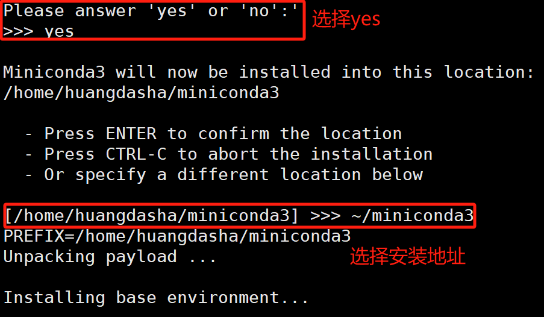

# 一、 树莓派搭建基础环境

## 1.ip以及远程连接

### 1.1 首先下载官方烧录系统软件。

[Raspberry Pi OS – Raspberry Pi](https://www.raspberrypi.com/software/)（软件下载地址）

选择Windows类型（这里如果不是Windows用户的友友们可以不用看了，因为后面是基于Windows的远程操控来实现的，苹果的没有，苹果的电脑就只能通过VNC来远程操控树莓派了。）


### 2.烧录我们需要的系统至内存卡中。（需准备一个内存卡以及一个读卡器）

下面是sd卡装到读卡器插到电脑上的图片。


编辑

然后打开之前我们下好的官方系统烧录软件，分别选好对应的树莓派型号以及需要烧录的系统和sd卡，我这里选择的是Raspberrt 4、Raspberry PI OS（64-bit），sd卡：


下一步点击NEXT开始配置我们需要的系统：


​    其中的用户名和密码自己需要记住，以及连接的WIFI可以是手机热点也可以是路由器啥的，反正要正确就行。最重要的就是一定要开启SSH服务！！！不然后面步骤肯定是没用的

​    随后就点击保存是等操作将系统下入sd卡即可（注意下入SD卡的时候是会将SD卡给格式化的所以最好是找一张新卡来烧录系统）

### 3.下载putty

[Download PuTTY: latest release (0.80) (greenend.org.uk)](https://www.chiark.greenend.org.uk/~sgtatham/putty/latest.html) 

上面是putty官网地址，进入官网下载即可（如若发现不能下载请科学上网，或找其他帖子百度网盘下载）

进入后选择电脑对应的配置下载，我这里是64位的电脑所以选择箭头对应的putty。

编辑

具体安装不再详述，可查其他码友文章一步步详细下载教学。

### 4.开始找树莓派IP地址（需要准备树莓派）

首先先将树莓派通过网线与电脑相连接，如下图所示：


再通过电脑设置进入网络适配器页面（因为我的是win11系统所以可以直接搜网络适配器然后点击管理网络适配器便可以进入需要我们操作的页面，不同系统的友友们可能就需要自行找一下了）：


随后给树莓派接通电源，看看哪个以太网有变化（因为每个电脑的网口不一样，所以需要通过这个操作来实现对网口的判断）。

以下是我给树莓派通电后以太网接口的变化：


可以看到当树莓派通电后以太网发生了变化，从 未连接 -----> 未识别的网络，这就说明树莓派接的网口便是以太网而不是以太网2。

接下来设置WIFI，点击共享：


在共享中按照以上操作，家庭网络连接选择以太网（若连接网口不是这个则换）。


按照上面操作进入Internet协议版本，选择“使用下面的IP地址” ，把其中IP地址改为如图所示。

随后打开Windows的命令提示窗口（cmd，可以使用win+R输入cmd快捷打开），输入arp -a(注意arp和-a中间有个空格)：


如图输入arp -a后便出现我们之前设置以太网的IP地址段，其中除了192.168.137.255（这个可以看作广播码，我们不需要）以外就一个192.168.137.95这个就是我们需要的树莓派ip地址。

### 5.打开putty进行相应操作

输入我们获得的树莓派IP地址，再点击open：


接下来输入我们之前在烧录树莓派系统时的Username（用户名）以及我们的密码（这里输入的时候不会显示你输入了几位但是只是它隐藏了，并不是你没有输入进去）：


当看到下面那行绿色的便代表你已经成功进入树莓派了，这个时候还是只能通过代码操作，为了能看到图形界面必须要输入一个指令让其下载我们需要的软件（指令：sudo apt-get install xrdp）：


如图操作，我是已经下载好了所以显示我已经下载了，当第一次下载的时候需要很长时间（因为是默认在外网下载，所以需要耐心等待），此外下载还会出现【Y/N】这种符号，并且卡住不动，这就是需要你输入一个y然后回车就行，代表你同意了安装，其他便等待下载完毕即可。

### 6.打开Windows远程操控


直接按win搜索应该就有了，再输入我们之前获得的树莓派IP地址连接即可：


随后输入之前烧录系统的用户密码便可以看到树莓派优美的界面啦！！！


## 2.找不到IP地址解决方法

### 2.1 由于WIFI共享不稳定导致的找不到IP问题

只需重新将WIFI共享取消掉再共享，相当于刷机行为来刷出树莓派IP地址：


### 2.2.由于之前装过虚拟机导致的网段被占用问题（这个坑了我两天，我真的哭死）


​    在网路适配器中把这些虚拟器全部禁用！！！！！！！！！

​    不然你cmd输入arp -a的时候会发现根本不会出现192.168.137这个网段，因为被这些虚拟机给占用了！！！！俺就是因为这个原因两天！两天啊！因此写出此文希望大家不要也像我一样被坑了！！！

​    还有其他问题的友友们，欢迎大家向我提出问题，和大家一同讨论解决问题！！！

## 3. 远程桌面连接闪退问题

首先是争对ubuntu20.04系统的桌面安装命令：

```
#1安装桌面
sudo apt update
sudo apt-get install xubuntu-desktop
#2安装XRDP
sudo apt install xrdp
echo gnome-session > ~/.xsession
#3 xfce桌面
echo xfce4-session >~/.xsession
#别的桌面应该也可以设置 搜一下就好
 
#4 安装完成,开启服务 
sudo systemctl start xrdp
 
#5默认情况下，Xrdp 使用/etc/ssl/private/ssl-cert-snakeoil.key,它仅仅对“ssl-cert” 用户组成语可读。运行下面的命令，将xrdp用户添加到这个用户组：
 
sudo adduser xrdp ssl-cert
 
#6重启 Xrdp 服务，使得修改生效：
 
sudo systemctl restart xrdp
 
#7 如果有防火墙的话 开启防火墙
sudo ufw allow 3389
```

安装完成后如果发现通过windows自带的远程桌面连接连接树莓派桌面时会发生闪退现象有以下几种可能：

### 1 .root用户正常登录其他闪退

root用户可以正常登陆，其他用于登录闪退

这时候只要修改 **.ICEauthority** 文件的权限后重启就可以了，这个文件就在用户目录 ~/ 下。

```
cd ~ (进入用户界面，需要操作的文件就在里边)
ls -al
ch sudo chown administrator:administrator.ICEauthority
sudo service xrdp restart
```

这种情况是通过更改 **.ICEauthority** 文件的权限来实现的，因为这个时候可能这个文件的权限被改成只能root用户访问了，而不能给普通用户进行访问。这时候只要我们修改了文件的访问权限就可以使这个文件正常被普通用户所访问，这样远程桌面就不会受到影响了。


## 4. 下载速度过慢的问题

​	下载速度过慢的原因是树莓派默认的下载位置是在国外的，所以国内访问下载网速很慢，解决方法就是用国内镜像网站来解决问题，以下是**Debian12的演示**（可通过lsb_release -a指令来查看）。

```
sudo vim /etc/apt/sources.list

//下面修改文件内容，将原本的源替代掉即可。
//阿里云源
deb https://mirrors.aliyun.com/debian/ bookworm main non-free non-free-firmware contrib
deb-src https://mirrors.aliyun.com/debian/ bookworm main non-free non-free-firmware contrib
deb https://mirrors.aliyun.com/debian-security/ bookworm-security main
deb-src https://mirrors.aliyun.com/debian-security/ bookworm-security main
deb https://mirrors.aliyun.com/debian/ bookworm-updates main non-free non-free-firmware contrib
deb-src https://mirrors.aliyun.com/debian/ bookworm-updates main non-free non-free-firmware contrib
deb https://mirrors.aliyun.com/debian/ bookworm-backports main non-free non-free-firmware contrib
deb-src https://mirrors.aliyun.com/debian/ bookworm-backports main non-free non-free-firmware contrib

//中科大源
deb https://mirrors.ustc.edu.cn/debian/ bookworm main non-free non-free-firmware contrib
deb-src https://mirrors.ustc.edu.cn/debian/ bookworm main non-free non-free-firmware contrib
deb https://mirrors.ustc.edu.cn/debian-security/ bookworm-security main
deb-src https://mirrors.ustc.edu.cn/debian-security/ bookworm-security main
deb https://mirrors.ustc.edu.cn/debian/ bookworm-updates main non-free non-free-firmware contrib
deb-src https://mirrors.ustc.edu.cn/debian/ bookworm-updates main non-free non-free-firmware contrib
deb https://mirrors.ustc.edu.cn/debian/ bookworm-backports main non-free non-free-firmware contrib
deb-src https://mirrors.ustc.edu.cn/debian/ bookworm-backports main non-free non-free-firmware contrib

//网易源
deb https://mirrors.163.com/debian/ bookworm main non-free non-free-firmware contrib
deb-src https://mirrors.163.com/debian/ bookworm main non-free non-free-firmware contrib
deb https://mirrors.163.com/debian-security/ bookworm-security main
deb-src https://mirrors.163.com/debian-security/ bookworm-security main
deb https://mirrors.163.com/debian/ bookworm-updates main non-free non-free-firmware contrib
deb-src https://mirrors.163.com/debian/ bookworm-updates main non-free non-free-firmware contrib
deb https://mirrors.163.com/debian/ bookworm-backports main non-free non-free-firmware contrib
deb-src https://mirrors.163.com/debian/ bookworm-backports main non-free non-free-firmware contrib

//腾讯云源
deb https://mirrors.cloud.tencent.com/debian/ bookworm main non-free non-free-firmware contrib
deb-src https://mirrors.cloud.tencent.com/debian/ bookworm main non-free non-free-firmware contrib
deb https://mirrors.cloud.tencent.com/debian-security/ bookworm-security main
deb-src https://mirrors.cloud.tencent.com/debian-security/ bookworm-security main
deb https://mirrors.cloud.tencent.com/debian/ bookworm-updates main non-free non-free-firmware contrib
deb-src https://mirrors.cloud.tencent.com/debian/ bookworm-updates main non-free non-free-firmware contrib
deb https://mirrors.cloud.tencent.com/debian/ bookworm-backports main non-free non-free-firmware contrib
deb-src https://mirrors.cloud.tencent.com/debian/ bookworm-backports main non-free non-free-firmware contrib
```

​	上面演示的是Debian是因为这个版本现在比较新，清华大学镜像网站还没有更新，所以Debian12用上面方法可以解决，而其他版本只需要登陆清华大学镜像网站跟对应的版本进行镜像网站的操作就可以了**（当然也可以直接试试上面的源）**：

```
https://mirrors.tuna.tsinghua.edu.cn/help/raspbian/  （清华大学镜像网站）
```

​	**单次运行加速代码：**

```
# 使用阿里云的HTTPS镜像源
pip install 安装包名称 -i https://mirrors.aliyun.com/pypi/simple/
```


# 二、树莓派点灯的两种操作方法

## 2.1 通过WirinigPi库直接在终端操作实现对led灯的控制

​	首先可以通过gpio readall指令查看树莓派管脚在BCM、WiringPi等格式下的引脚编号：


​	如图便是执行指令后显示的各个引脚在不同编码模式下的引脚编号，以及引脚一般的作用都在图中有显示。


​	如上图所示对应的gpio的命令就是这些，我们首先需要设置引脚的模式，上面图中设置的便为引脚的输出模式。去掉-g就变为wiringPi的引脚编码格式。

​	随后进行如上图中的操作就可以设置引脚的输出电平啦！

## 2.2 通过C语言编程对led灯的控制

话不多说直接上示例程序：

```
#include <stdio.h>
#include <wiringPi.h>

#define LED0 7 // 设置GPIO0为控制LED的引脚

int main()
{
  printf("Hello world\n");

  wiringPiSetup(); // 初始化gpio
  pinMode(LED0, OUTPUT); // 设置gpio0为输出模式

  while (1) {
  // 设置GPIO0为高电平
  printf("Set GPIO0 : H\n");
  digitalWrite(LED0, HIGH);
  delay(1000);

  // 设置GPIO0为低电平
  printf("Set GPIO0 : L\n");
  digitalWrite(LED0, LOW);
  delay(1000);
  }
  return 0;
}

```


通过vim编译器创建一个.c文件再利用c语言进行编程即可。编程完成之后在文件夹中会有一个.c文件，这时候就需要用到gcc编译器来对.c文件进行编译，代码如下：

```
// 当然文件名不同的话下面的文件名称也得改，加上一个-lwiringPi的意思就是链接上wiringPi库，防止包含头文件却链接不到头文件。
gcc -o gpio gpio.c -lwiringPi
```

完成后便会生成一个gpio文件，此文件就是.c文件经过编译后得到的可执行文件，这时候再将此文件执行即可，执行命令：

```
// ./相当于执行可执行文件，后面加可执行文件的名字即可实现文件中设置的功能。
./gpio
```


## 2.3 通过树莓派专属库RPi进行驱动

下面是示例代码：

```
import RPi.GPIO as GPIO

# 设置引脚编号模式（有BCM、wringpi等编码格式）
GPIO.setmode(GPIO.BCM)

# 定义你要读取的引脚（这里对应的是上面编码格式的引脚）
pin = 18
GPIO.setup(pin, GPIO.IN) # 设置为输入模式

pin1 = 23  
GPIO.setup(pin1, GPIO.OUT) # 设置为输出模式

GPIO.input(pin) # 读取引脚的高低电平，高电平返回1 低电平返回0

GPIO.output(pin1, GPIO.LOW) # 23引脚输出低电平
GPIO.output(pin1, GPIO.HIGH) # 23引脚输出高电平 
```

​	唯一要注意的一点就是运行的时候如果发现相应的库安装的都没问题，但是通过python 与 python3 运行都会报错显示没有依赖库，这个时候就必须通过 （sudo python3 xxx.py）来进行运行。（我的系统Ubuntu22.04会存在这种情况）。

# 三、树莓派图像识别方面

## 3.1  拍摄一张照片

### 3.1.1 通过raspistill实现拍照功能

首先显示安装拍摄照片的库：

```
sudo apt install libraspberrypi-bin （下载有关树莓派摄像头的驱动库）
```


首先如图，将摄像头按照上图方式接好，接好后可以直接尝试以下指令看是否能拍摄一张照片，下列代码的意思是在**1s后**拍摄一张**名字为a.jpg**的照片：

```
raspistill -o a.jpg -t 1000 
-o：指定输出图像文件的路径和名称。
-w：指定图像的宽度。
-h：指定图像的高度。
-q：指定图像的质量（0-100）。
-t：指定拍摄照片的时间，单位为毫秒。
-ex：指定曝光模式，例如 auto、night、nightpreview、backlight、spotlight 等。
-ISO：指定 ISO 值。
-br：指定亮度。
-co：指定对比度。
-sh：指定饱和度。
-ifx：指定图像效果，例如 none、negative、solarise、sketch、denoise 等。
-awb：指定白平衡，例如 auto、sunlight、cloudy、tungsten、fluorescent、incandescent、flash、horizon 等。
-v：显示调试信息。
```


​	最后效果就是在当前文件夹拍摄了一张名为a.jpg的照片.（但是需要注意的一点是拍摄照片并保存需要在指定位置中保存，比如用户文件夹pi中，最好是用户文件夹pi中的pictures中拍摄照片并保存，这样也有利于后期的寻找）

### 3.1.2 通过 fswebcam 插件实现拍摄功能

首先安装 fswebcam 插件：

```
sudo apt-get install fswebcam
```

执行命令：

```
fswebcam -r 640x480 --no-banner image.jpg
-r <width>x<height>：指定图像的分辨率（宽度和高度），例如 1280x720。
--no-banner：移除默认的图像标注（时间戳、版本信息等）。
-d <device>：指定摄像头设备路径，默认是 /dev/video0。
-S <frames>：跳过指定数量的帧，适合用于摄像头初始时需要稳定的情况。
-F <frames>：从指定帧数中获取平均值来生成图像，减少噪点。
-s <interval>：设置拍摄的时间间隔（以秒为单位）。
-i <delay>：拍摄前的延迟时间，单位为秒。
-q <quality>：指定图像的质量，范围为 1 到 100。
--jpeg <quality>：设置 JPEG 图像质量。
--png <compression>：设置 PNG 压缩级别（0-9）。
--flip h：水平翻转图像。
--flip v：垂直翻转图像。
--crop <width>x<height>：裁剪图像到指定宽度和高度。
--top-banner：显示图像标注在顶部。
--title <text>：为图像添加标题。
--subtitle <text>：为图像添加副标题。
--info <text>：为图像添加额外的注释信息。
--timestamp：在图像上显示当前时间戳。
--save <filename>：指定保存的文件名。
```

### 3.1.3 通过python代码实现拍照功能

​	以下实现的是通过BCM编码格式下的18引脚用作输入引脚，外接一个按键，当按键按下时便会自动进行拍照。

```
import RPi.GPIO as GPIO
import time
import cv2

# 设置引脚编号模式
GPIO.setmode(GPIO.BCM)

# 定义你要读取的引脚
pin = 18
GPIO.setup(pin, GPIO.IN)

# 初始化摄像头
cap = cv2.VideoCapture(0)

try:
    while True:
        if GPIO.input(pin):  # 检测高电平
        	pass
        else:
            # 读取一帧
            ret, frame = cap.read()
            if ret:
                # 创建时间戳
                timestamp = time.strftime("%Y%m%d-%H%M%S")
                filename = f"photo_{timestamp}.jpg"  # 设置文件名
                
                # 保存图像
                cv2.imwrite(filename, frame)
                print(f"照片已保存: {filename}")
                
                time.sleep(1)  # 防止连续拍照

except KeyboardInterrupt:
    pass
finally:
    cap.release()  # 释放摄像头
    GPIO.cleanup()  # 清理 GPIO 设置
```

### 3.1.4 树莓派同时控制两个摄像头拍照

​	我其实在使用树莓派同时进行两个摄像头的控制拍照的时候遇到过一个问题，就是两个摄像头会相互抢夺资源导致一方摄像头无法进行拍照，所以要解决这样的问题便只能够初始化一个摄像头，然后再将这个摄像头释放掉，再初始化另一个摄像头，这样反复的切换，以达到一份代码驱动两个摄像头的效果（事实上就算是两个摄像头分别放在两个代码里同时运行两份代码，最终也无法实现两个摄像头同时拍照的效果），示例代码如下**（代码并没有经过实际应用，不一定能直接使用）**：

```
import RPi.GPIO as GPIO
import time
import cv2

# 设置引脚编号模式
GPIO.setmode(GPIO.BCM)

# 定义你要读取的引脚
pin = 18
GPIO.setup(pin, GPIO.IN)

cap2 = cv2.VideoCapture(2)  # 第二个摄像头

# 初始化拍照计数
count = 1

try:
    while True:
        if GPIO.input(pin):
            pass
        else:
            # 初始化摄像头
            cap1 = cv2.VideoCapture(0)  # 第一个摄像头

            # 读取一帧
            ret1, frame1 = cap1.read()
            
            if ret1:
                # 创建时间戳
                timestamp = time.strftime("%Y%m%d-%H%M%S")
                filename1 = f"photo_1_{count}.jpg"  # 第一个摄像头命名
                
                # 保存图像
                cv2.imwrite(filename1, frame1)

                time.sleep(1)  # 防止连续拍照
            cap1.release()  # 释放第一个摄像头
            
            cap1 = cv2.VideoCapture(2)  # 初始化第二个摄像头
            
            # 读取一帧
            ret1, frame1 = cap1.read()
            
            if ret1:
                # 创建时间戳
                timestamp = time.strftime("%Y%m%d-%H%M%S")
                filename1 = f"photo_1_{count}.jpg"  # 第一个摄像头命名
                
                # 保存图像
                cv2.imwrite(filename1, frame1)

                time.sleep(1)  # 防止连续拍照
            cap1.release()  # 释放第二个摄像头
            

except KeyboardInterrupt:
    pass
finally:
    GPIO.cleanup()  # 清理 GPIO 设置
```


## 3.2  拍摄一段视频

拍摄视频最简单的函数：

```
raspivid -o test.h264 -t 10000 //拍摄一个名为test.h264的视频文件
-t：指定录制视频的时间，单位为毫秒。
-w：指定视频的宽度。
-h：指定视频的高度。
-fps：指定视频的帧率。
-b：指定视频的比特率。
-o：指定输出视频文件的路径和名称。
-vf：垂直翻转视频。
-hf：水平翻转视频。
还可以使用raspivid -- help来看参数选择
```


​	最后的效果就算生成一个名为test.h264的文件，但是这个文件只能树莓派自己解析，我们的windows是无法看h264的视频，所以我们需要想办法把这个视频文件转为MP4格式的视频，这样我们windows就可以轻松查看了。

​	这个时候需要用到一个FFmpeg 工具，这是一个处理多媒体非常强大的工具，要将h264的视频文件转化为MP4文件只需使用以下指令：

```
sudo apt install ffmpeg //这个指令是没有安装过ffmpeg的时候使用安装库的
ffmpeg -i input.h264 -c:v copy output.mp4 //这个命令意思是将input.h264文件复制并且转为名为output.mp4的mp4格式的视频文件
```


​	最后就实现了将h264文件转为MP4文件的操作，最后再用xrdp或者其他文件传输软件便可以把mp4视频文件传到windows桌面上供大家观赏啦~


## 3.3 当作监控通过http访问

想要将树莓派当作监控来观测，简单的拍照和拍视频库是无法实现的，这里需要一个库：**motion**

```
sudo apt-get install motion //安装motion工具
```

安装后便可以使用motion功能来当作是远程监控了，但是我们要使其运行的话还需要配置一些功能，首先打开文件夹/etc/motion/，这个文件夹中包含着motion初始化时的参数：

```
cd /etc/motion/ 
```

在里边可以找到文件motion.conf


随后随便用一个编辑器打开这个文件即可，我这里用的时Vim编译器：

```
sudo vim motion.conf (这里一定要用sudo不然没有权限修改文件)
```

进去之后里面的参数就是motion监控时基本所有的参数（这里基本的很重要待会要考！），我们修改这些参数

```
deamon off -----> deamon on （改为后台持续运行）
framerate 2 -----> framerate 60 (将帧率改为60帧)
stream_localhost on ----> stream_localhost off (这里设置是否仅在主机上提供视频流，设置为off就是会同时提供给主机和局域网内其他的设备)
stream_maxrate 200 (这个是控制视频流最大帧率的参数，这里的意思是视频流最大帧率不超过200)
```

​	上侧前三条参数都可以再参数中找到，我找半天都找不到第四个参数，于是一开始我就没有设置第四个参数，结果我发现不管我怎么调framerate这个帧率参数，摄像头拍摄的帧率始终只有1帧，**结果最后发现这个文件中确实没有这个参数，这个参数需要我们自己添加**，真的是太恶心了，大家只需要在某的地方加上第四段设置就好了。


​	我是添加在了上图的位置。随后我们设置完毕之后就保存文件退出就好，vim编译器在这里操作是：1.按下i进入编辑模式  2.改完后按下ESC在输入中文的冒号：wq保存并退出，如果这样说还不懂的友友们可以去看看vim编译器操作流程。

​	最后重启motion新的配置就会生效了：

```
sudo killall -TERM motion (改指令意义在于关闭所有在运行的motion程序)
sudo motion (重新开启motion)
```

​	**开启后需要访问的话请继续往下看！！！！**

​	第二个坑人的地方（端口问题）：大家可能会看上面图片有一个stream_port 8081，描述是The port number for the live stream，简而言之就是用于设置Motion实时视频流服务的端口号。通过该端口号，可以从Motion中获取实时视频流，用于监视和录制。

​	而这个时候有另一个就是web的端口号如下图所示：


​	我看很多文章说的都是用http访问这个web端口来实现所以一开始也是用http://192.168.85.174:8080这个去访问motion监控内容（其中192.168.85.174是我树莓派的ip地址，如果有不知道ip地址怎么找的请看我前面一篇文章），后面发现根本没有界面，于是访问http://192.168.85.174:8081发现就有界面了，所以访问的话还是要看上面图片中的端口号，至于为什么我现在还不知道，有知道的大佬麻烦指教下，谢谢！


## 3.4 安装tensorflow库

​	首先在正常的树莓派环境下直接使用pip install的安装命令会发现会报错，据csdn大佬来说是由于os的原因导致无法直接pip install下载tensorflow库。**所以我们首先需要的是创建一个虚拟环境！**

```
# 安装python3-venv包，如果还没安装的话
sudo apt install python3-venv

# 创建一个新的虚拟环境，myenv是虚拟环境所在的系统文件夹，在~目录中。
python3 -m venv myenv

# 激活虚拟环境
source myenv/bin/activate

# 现在你可以在虚拟环境中安装tensorflow
pip3 install tensorflow

# 用完环境后退出虚拟环境

```

​	当然在安装tensorflow的时候会发现中途会有很多报错，这些大多数都是因为没有安装依赖库导致的，下面是一位大佬列出来需要用到的依赖库，可以提前下载好：

```
$ sudo apt-get install -y libhdf5-dev libc-ares-dev libeigen3-dev gcc gfortran python-dev libgfortran5 \
                          libatlas3-base libatlas-base-dev libopenblas-dev libopenblas-base libblas-dev \
                          liblapack-dev cython openmpi-bin libopenmpi-dev libatlas-base-dev python3-dev
```

​	当然最重要的还是一边下载一遍解决问题，发现报错就将报错的库拿出来单独下载。直接在虚拟环境中用pip intall来下载报错的库，大概率能解决，还有就是如果用的是国内的镜像网站下载不要开VPN！


## 3.5 对于Ubuntu找不到摄像头问题

参考文章：[树莓派4B摄像头安装+Ubuntu22.04系统摄像头识别-CSDN博客](https://blog.csdn.net/yunandfei/article/details/129031137)

首先执行命令看看是否可以检测识别到摄像头：

```
vcgencmd get_camera
```


结果会返回两个参数，supported = 0意为支持的摄像头为0 ， detected = 0 意味已连接的摄像头为0，这两个参数为0说明我们树莓派根本就没有识别到连接的摄像头，这个时候一般都是驱动的问题，或者根本没有检测到摄像头。接下来按下面步骤执行。

**1、修改TF卡中的config.txt文件**

关机后，将TF卡从树莓派上拔出，插入电脑，找到config.txt文件，如下图所示：


在文件最后加上如下命令：加在最后【all】下面

```
gpu_mem=128
start_x=1
```

注释摄像头设备自动发现命令：

```
#camera_auto_detect=1 （但是经过我实践发现这个文件中根本没有这行代码，所以也有可能是没有自动发现摄像头命令导致的）
```

保存config.txt文件之后重新插卡到树莓派上并开机。

**2、进入系统，修改/etc/modules**

首先进入系统修改/etc/modules：

```
sudo vim /etc/modules
```

在modules文件最后面添加如下命令：

```
bcm2835-v4l2
```

：wq保存后退出文件并重启系统。

# 四、树莓派配置yolo

## 4.1 64位树莓派系统安装yolo环境

1.安装一个可以运行虚拟环境的软件（可以选择 Miniconda 或者 Anaconda），这里选择用 Minicanda 来实现。

```
# 下载 Miniconda： 使用以下命令下载适用于 ARM 架构的 Miniconda 安装脚本（注意，这里仅适用于64位系统）：
wget https://repo.anaconda.com/miniconda/Miniconda3-latest-Linux-aarch64.sh
# 运行安装脚本：
bash Miniconda3-latest-Linux-aarch64.sh
# 在安装过程中，阅读许可协议并按 Enter 键继续。
# 当提示时，输入 yes 同意安装。
# 输入yes之后，按照提示选择安装路径（默认通常是 ~/miniconda3）。

# 安装完成之后永久添加到开机启动路径（注意这里的miniconda3是之前安装的位置）
export PATH="$HOME/miniconda3/bin:$PATH"
conda init
source ~/.bashrc
```




2.创建一个新的虚拟环境

```
# 创建一个名为 yolov8 的虚拟环境，且给这个虚拟环境搭建一个python版本为3.8的环境
conda create -n yolov8 python=3.8

# 进入虚拟环境
conda activate yolov8
```


3.安装torch 、 torchvision

```
# 记得要先进入虚拟环境再安装
# torch 不可以安装最新版本，最新版本有bug，推荐安装1.8.1版本
pip install torch==1.8.1 -i https://pypi.tuna.tsinghua.edu.cn/simple

# 安装`torchvision`，注意版本要对应 
pip install torchvision==0.9.1 -i https://pypi.tuna.tsinghua.edu.cn/simple
```


## 4.2 32位树莓派系统安装yolo环境（未实践）

1.安装pytorch

安装pytorch的时候要进入网站找到对应的版本，以下是下载地址：

[armv7l](https://blog.csdn.net/m0_46324847/article/details/128891706?ops_request_misc=%7B%22request%5Fid%22%3A%22170851169716800188574045%22%2C%22scm%22%3A%2220140713.130102334..%22%7D&request_id=170851169716800188574045&biz_id=0&utm_medium=distribute.pc_search_result.none-task-blog-2~all~sobaiduend~default-1-128891706-null-null.142^v99^pc_search_result_base3&utm_term=树莓派32位上安装torch&spm=1018.2226.3001.4187) [arrch64](https://github.com/KumaTea/pytorch-aarch64/releases)


若不知道怎么找对应版本，首先输入：

```
uname -a
```


若不知道当前python的版本，输入：

```
python
```


出现以上图片说明当前系统架构是 aarch64 的，且虚拟环境中python版本为3.8.19，所以我们就进入上面给出的aarch64位下载地址。进入之后根据python来选择**对应的版本的torch的whl文件**：


将以上两个文件下载下来然后传到树莓派的桌面上。


2.安装torch

```
pip3 install torch-1.8.1-cp39-cp39m-linux_armv7l.whl（自己刚下载的文件名）
```

验证：

```
python3
>>> import torch
>>> torch.rand(5,3)
```


3.安装torchvison

```
# 安装依赖
sudo apt-get install libjpeg-dev zlib1g-dev libpython3-dev
sudo apt-get install libavcodec-dev libavformat-dev libswscale-dev

# 安装torchvision
pip3 install torchvision.......(自己刚刚下载对应的文件名称)
```


## 4.3 安装yolov8

​	相对于pc端来说，不同点便在于，树莓派中不能够直接使用  pip install ultralytics 来进行安装 ultralytics 库，而是要通过 github 上面下载源码到树莓派上，然后将代码和训练好的模型放到下载的文件夹下，然后安装yolo所需的依赖，就可以运行啦，不论是v8还是v5，都可以这样操作。

首先安装以下opencv：

```
# 确保 pip 已安装： 如果你还没有安装 pip，可以使用以下命令安装：
sudo apt update
sudo apt install python3-pip

# 安装 OpenCV： 使用 pip 安装 OpenCV：
# 使用国内清华源来下载，不然可能会超时
sudo apt-get install libgtk2.0-dev pkg-config
pip install opencv-python -i https://pypi.tuna.tsinghua.edu.cn/simple 
pip install opencv-python-headless -i https://pypi.tuna.tsinghua.edu.cn/simple # 可选，适合没有 GUI 的环境
```


获取yolov8：

```
# 安装ultralytics，记得一定要先进入虚拟环境
pip install ultralytics -i https://pypi.tuna.tsinghua.edu.cn/simple
```


修改摄像头权限：

```
sudo vim /etc/udev/rules.d/99-usb-camera.rules
KERNEL=="video[0-9]*", MODE="0666"
sudo udevadm control --reload-rules
sudo udevadm trigger
```

设置完成之后验证代码：

```
# 如果运行之后能够显示所有的设备说明修改成功了
ls -l /dev/video*
```


## 4.4 运行yolov8进行识别

创建python文件将以下代码添加进去（首先要确定树莓派的摄像头有没有成功接入进去）进行初次尝试：

```
import cv2
from ultralytics import YOLO
from cv2 import getTickCount, getTickFrequency
# 加载 YOLOv8 模型
model = YOLO("best.pt") # 这里选择你训练的模型
 
# 获取摄像头内容，参数 0 表示使用默认的摄像头
cap = cv2.VideoCapture(0)
 
while cap.isOpened():
    loop_start = getTickCount()
    success, frame = cap.read()  # 读取摄像头的一帧图像
 
    if success:
        results = model.predict(source=frame) # 对当前帧进行目标检测并显示结果
    annotated_frame = results[0].plot()
 
    # 中间放自己的显示程序
    loop_time = getTickCount() - loop_start
    total_time = loop_time / (getTickFrequency())
    FPS = int(1 / total_time)
    
    # 在图像左上角添加FPS文本
    fps_text = f"FPS: {FPS:.2f}"
    font = cv2.FONT_HERSHEY_SIMPLEX
    font_scale = 1
    font_thickness = 2
    text_color = (0, 0, 255)  # 红色
    text_position = (10, 30)  # 左上角位置
 
    cv2.putText(annotated_frame, fps_text, text_position, font, font_scale, text_color, font_thickness)
    cv2.imshow('img', annotated_frame)
    # 通过按下 'q' 键退出循环
    if cv2.waitKey(1) & 0xFF == ord('q'):
        break
 
cap.release()  # 释放摄像头资源
cv2.destroyAllWindows()  # 关闭OpenCV窗口
```

最终效果：


但是这样的话帧率会很小，所以后面将通过NCNN来优化模型。


## 4.5 NCNN模型优化

第一步安装NCNN模型：

```
pip install ncnn -i https://pypi.tuna.tsinghua.edu.cn/simple
```


将 .pt 模型转换为 NCNN 模型：

```
# 其中 model 是原始模型 ， 转换为名为 best_ncnn_model 的ncnn模型
yolo export model=best.pt format=ncnn  # creates 'best_ncnn_model'
```

转换过程比较漫长，但是只要前面的环境没有出问题，并且成功测试了直接跑 yolov8 模型，那转换就只剩下了时间问题。


## 4.6 报错问题（摄像头问题）

如果发现报错用不了首先检查一下摄像头：

```
# 安装 fswebcam
sudo apt-get install fswebcam

# 可以采用以下指令对摄像头进行识别，如果识别完出来的结果都为0则说明也是没有识别到摄像头
vcgencmd get_camera

# 拍摄一张名为test_image.jpg的图片，如果能拍说明没有问题，但是如果拍不了就要考虑摄像头的问题了。
fswebcam -r 640x480 test_image.jpg
```

vcgencmd get_camera 的结果如下便说明这个摄像头是识别到了的：


而这一次我遇到的问题就是摄像头无法识别（可能是摄像头比较老的原因），这种情况下我直接把树莓派的SD卡拔了下来，用读卡器修改SD卡中的 config.txt 文件：


在文件最后加上如下命令：

```
gpu_mem=128
start_x=1

# 然后将自动发现摄像头命令给注释掉
#camera_auto_detect=1
```


完事之后再将SD卡插回去，再用 vcgencmd get_camera 检测以下摄像头情况就会发现识别到摄像头辣：


