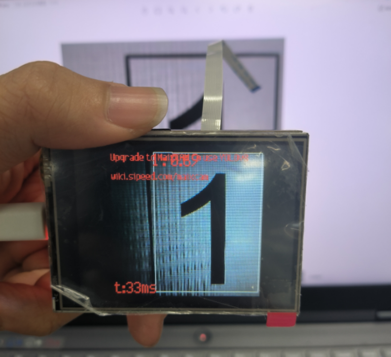

# 一、关于yolo5的研究

## 1.自己训练数据集

​	首先在下载的yolo5模型文件中创建我们所需要的文件夹，


​        我这里首先是在yolo5文件夹中创建了一个属于自己训练数据的文件夹，其中可以通过文件名字分别数据类型，本次将通过第一个识别安全的safe文件夹数据来演示，如下图所示：


​	其中就只有两个文件夹，一个是images用来储存图片的文件夹，另一个是labels文件夹用来储存之前通过labelimg软件得到的标签的文件，而且这两个文件夹中都含有两个文件夹，分别是train文件夹和val文件夹，分别起到训练模型和验证模型的作用（这里的验证是指验证训练模型用在图片上的实际效果，最终训练完之后会存到runs/train中，具体可看后面通过中断训练之后的文件保存地址）:


​	上面就是前面所说的文件分类形式，在safe/images中保存的都是图片，其中就是通过safe/images/train中的文件训练，然后再通过用safe/images/val中的文件去验证效果。而Labels中放的就是Labelimg生成的文件。

​	这些文件配置完成后便可以配置两个yaml文件，首先第一个是在/data文件夹中创建一个属于自己的yaml文件，本次示例名称为safe.yaml，其中包含了训练的路径还有标签等路径，具体看下图所示：


​	如图，其中最恶心的一点在于train和val的路径最好是写如图的绝对路径，不然后面用指令运行代码的时候很容易就会报错。

**注意！！！**其中的nc是你需要识别物体的种类个数，而后面的名称**一定要和labelimg创建出来之后的分类的先后顺序相同**。

​	

​	修改完这个关于链接训练模型的数据之后，接下来需要选择的便是模型的建立，首先直接在models/文件夹中随便复制一种模型类型（如上图所示）这里建议模型小的时候选择yolo5s.yaml复制重命名就行，如图我便是重命名为了yolov5s_safe.yaml文件，其中不要修改模型的创建代码，唯一需要修改的就是**需要识别物体种类的个数**，如图所示：


​	有几种类型的标签便选择几种类型，我这里是只有两种所以只写了2。

**当所有文件都准备好之后，最重要的来了！！！！！！！！！！！！！！！！！！！！！！！！！！！！！！！！！！！！！！**

运行指令：

```
python train.py  --data data/safe.yaml --weights yolov5s.pt --epoch 10 --batch-size 1 --cfg models/yolov5s_safe.yaml 
```

--data：存储训练、测试数据的文件（就是指向之前那个存数据地址的yaml文件路径）。

--weights：权重文件路径，如果是’'则重头训练参数，如果不为空则做迁移学习，权重文件的模型需与cfg参数中的模型对应。

--epoch：指的就是训练过程中整个数据集将被迭代多少次（简单而言越多次就得训练越久，但是准确度不一定，有一个是迭代次数多了之后会有准确率下降的效应，所以也无需太多）。

--batch-siaze：每次梯度更新的批量数，指一次看完多少张图片才进行权重更新（**这里一定要注意，如果训练集的图片的数量较小一定要把这个值调小，因为这是指看几遍图更新一次，如若太大到不了更新的时候**）。

--cfg：存储模型结构的配置文件（就是我们后面只改了识别物体种类数量的那个yaml文件）。


​	输入指令训练完毕之后会在指定文件夹生成我们训练的文件：


​	如图便生成了最后训练的两个模型，然后需要用以下指令来通过这个训练出来的模型来处理图片：

```
python detect.py --source my_data/safe/images/val --data data/safe.yaml --weights runs/train/exp14/weights/best.pt 
```

​	如上运行时只需要改detect.py中的三个参数再进行识别：

--source：需要识别的图片的文件地址。

--data：就是之前训练自己数据集的。

--weights：是我们训练好之后的权重文件（一般是用best.pt）。

随后经过识别的图片就会生成在某文件夹下（具体看识别完毕之后的save路径）


# 二、关于yolov8的研究

## 1.配置环境

### 1.1 anaconda创建虚拟环境

​	可以先去官网下载anaconda，直接搜百度也能搜到名字，这里就不演示了。


​	创建完毕之后打开虚拟环境：


### 2.配置国内镜像源

​	在虚拟环境中，输入以下指令：

```
conda config --add channels https://mirrors.tuna.tsinghua.edu.cn/anaconda/pkgs/free/
conda config --add channels https://mirrors.tuna.tsinghua.edu.cn/anaconda/pkgs/main/
conda config --add channels https://mirrors.tuna.tsinghua.edu.cn/anaconda/cloud/conda-forge/
conda config --set show_channel_urls yes

pip config set global.index-url https://pypi.tuna.tsinghua.edu.cn/simple
pip config set install.trusted-host pypi.tuna.tsinghua.edu.cn
```


### 3.安装yolo

​	直接命令框中输入：

```
pip install yolo
```


### 4.安装必要工具

```
pip install ultralytics
pip install labelimg # 安装标注工具labelimg
pip install ncnn 
```

（若安装过程中发现有问题，但是通过看anaconda平台的channels发现镜像源确实换为了tsing hua源，这时可以考虑换一个网络（特别是校园网或者公司网络很容易出问题，建议换成手机热点再做尝试））


### 5.验证

输入：

```
yolo
```

若有类似以下输出无报错，则说明环境搭建的没问题：


## 2.新建训练目录

- 找个空目录，新建文件夹，名称叫做 **yolov8_test01** , 也可以是其他名称 , 这里的例子是在E盘的yolov8_test01文件夹
- 在 yolotrain 新建labels和images文件夹，在images文件夹新建test,train,val三个文件夹，在labesl下面新建train,val两个文件夹
- 结构入下图所示


- images文件夹下面的test,train,val三个文件夹，全部存放相同的要训练的图片，例如train下面是 1.png,2.png，将这个两个文件复制一份到val，再复制一份到test
- labels下面的train,val两个文件夹存放的是用labelimg标注的标签数据文件，等会 labelimg 使用会用到这个文件夹


## 3.标注数据

​	将准备好的图片放到 **images/train** 文件夹下面并且复制一份到 **images/val** 和 **images/test**两个文件夹，输入：

```
labelimg # 打开图片标注工具
```


​	**最后选择save保存当前选择的模式，之后便可以按照上面yolov5标注数据的方法进行标注即可。**

​	**全部标注完成之后**标注的文件就会放置到labels/train中，就将其中的文件全部复制到labels/val当中，所以目前位置所有的文件夹的内容是images中，test、train、val三个文件夹中全部是图像的源文件**（其中val是验证集文件，test是实际识别的时候的文件，如果图片数量很多要适当减少这两个文件中的图片数量）**，而labels文件夹中，train和val中全是标注后的图片（这里一样，图片多最好val中数据减少一些）


### 3.训练模型

在 **yolov8_test01** 文件下新建一个训练的配置文件，例如文件名称叫 **test.yaml**，使用记事本打开，填写内容如下:

```
path: E:/yolov8_test01
train: images/train
val: images/val
test: images/test
nc: 2
names: ["1","2"]
```

- 参数解释：
  - path: 代表训练的根目录，这里的 yolov8_test01 在E盘，就写 E:/yolov8_test01，其他盘的路径自己修改
  - train: 代表要训练的图片文件夹,相对于path路径
  - val: 代表要验证的图片文件夹,相对于path路径
  - test: 代表要测试的图片文件夹,相对于path路径
  - nc: 代表分类名称数量，这是2个，因为使用labelimg标注的是2个类别，如果是多个数据就跟和实际类别数量一样的即可
  - names: 是一个json数组，代表的是标注的分类名称，labelimg使用的是1和2两个分类名称，这里代表着两个需要识别东西的名称
  - 名称的顺序不要写错，会影响训练结果


- 在控制台输入命令

- 在cmd窗口，输入 `e:/` 回车，在输入 `cd yolov8_test01`，进入这个文件夹 `yolov8_test01`，其他路径自行进入

- 训练命令，下面两个任选一个，截图参数看ultralytics官网

  ```
  yolo detect train data=e:/yolov8_test01/test.yaml model=e:/yolov8_test01/yolov8s.pt epochs=100 imgsz=640
  # 这里会自动下载yolov8s.pt，但是是从github上下载，最好是等下载的时候会弹出下载地址，直接挂梯子前往github下载之后再把权重文件拖入我们训练的文件夹目录下
  # 这里的epochs=100代表着迭代训练100次，imgsz=640的意思则是图像的像素为640*640的
  ```

下面是训练过程：


## 4.验证模型

​	训练完成之后，会发现在原本训练的目录下生成了一个文件夹 runs 其中包含着以下的文件：


​	这便是生成的所有的文件，以下是参数说明：

1. **weights**：这是一个文件夹，里面存储了训练过程中保存的模型权重文件（ **last.pt 和 best.pt** ），可以用于后续的模型推理或测试。
2. **args.yaml**：这是一个YAML格式的配置文件，记录了训练时使用的参数，如训练批次大小、学习率、模型架构等。
3. **confusion_matrix.png** 和 **confusion_matrix_normalized.png**：混淆矩阵图，显示了不同类别之间的分类准确性。标准的混淆矩阵图显示原始分类结果，而归一化的混淆矩阵图则显示比例数据，便于比较。
4. **F1_curve.png**：F1曲线图，显示了不同置信度阈值下模型的F1分数。F1分数是精确率和召回率的调和平均，用于衡量模型性能。
5. **labels.jpg**：显示训练集或验证集中标签的分布情况，帮助了解各类别的样本数量分布。
6. **labels_correlogram.jpg**：显示标签之间的相关性，帮助分析标签之间的共现情况和类别不平衡问题。
7. **P_curve.png**：精确率曲线，显示不同置信度阈值下的模型精确率。
8. **PR_curve.png**：精确率-召回率曲线（Precision-Recall Curve），显示精确率与召回率之间的关系。
9. **R_curve.png**：召回率曲线，显示不同置信度阈值下的模型召回率。
10. **results.csv**：训练结果的CSV文件，记录了各个epoch的损失、精确率、召回率、mAP等指标，便于后续分析和对比。
11. **results.png**：训练结果汇总图，通常包括损失曲线、精确率曲线、召回率曲线等多个指标的变化情况。
12. **train_batch\*.jpg**：显示训练集中的一些批次数据及其预测结果的可视化，帮助直观查看模型在训练集上的表现。
13. **val_batch\*_labels.jpg** 和 **val_batch\*_pred.jpg**：验证集的数据和预测结果的可视化，分别显示真实标签和预测标签，用于评估模型的泛化能力。


也可以对模型进行验证，在虚拟终端输入**（注意：其中的 yolov8_test01 为训练的文件，test.yaml为创建的参数文件，这两个文件路径不能错）**：

```
yolo detect val data=e:/yolov8_test01/test.yaml  model=e:/yolov8_test01/runs/detect/train/weights/best.pt
```

下图为验证完成之后生成的文件路径，这个是相对路径，是指在训练空间下的，**绝对路径也就是 yolov8_test01\runs\detec\val** 。


最后生成的验证文件：


## 5.导出模型

将训练好的pt文件导出为ncnn文件，交给EC的函数调用

cmd控制台输入命令

model 参数代表要转换的模型

```
yolo export model=e:/yolov8_test01/runs/detect/train/weights/best.pt format=ncnn
```

​	导出模型的时候要下载`pnnx`组件，会自行下载，如若报错建议挂梯子，网络改为手机热点，再报错的话就网上搜索资源将别人下载好的拷贝过来便行，转换之后输出如下：


最后查看相对位置的文件夹就会发现最终生成的主要就是以下几个文件，这几个文件就是后面用来调用的模型：


## 6.使用模型

关于使用模型，首先创建一个 python 文件，随后使用 vscode 打开（此处只演示 vscode 的操作）。

1.打开终端，激活之前创建的虚拟环境（注意这里终端默认打开的是 powershell 的终端，而我们需要打开的是 Command Prompt 终端）：


2.进入之后首先激活之前创建的虚拟环境（看见命令行前面出现yolov8说明激活虚拟环境成功）

```
conda activate yolov8		# 这里的yolov8改为自己设置的虚拟环境名称
```


3.编写python文件（在这里我演示的是通过视频加载我之前训练识别数字的模型，**注意模型路径一定要用反斜杠（系统路径为斜杠路径，注意别搞错了）**）

```
import cv2
from ultralytics import YOLO

# 加载YOLOv8模型
model = YOLO('E:/yolov8_test01/runs/detect/train/weights/best.pt')  # 这里要什么就换什么yolov8i默认目标检测（i= n,m,l,x）尾缀有-pose,-seg

# 打开视频文件
# video_path = "path/to/your/video/file.mp4"
cap = cv2.VideoCapture(0)   # 0表示默认摄像头，如果有多个摄像头，可以尝试使用1, 2, 等

# 遍历视频帧
while cap.isOpened():
    # 从视频中读取一帧
    success, frame = cap.read()

    if success:
        # 在该帧上运行YOLOv8推理
        results = model(frame)

        # 在帧上可视化结果
        annotated_frame = results[0].plot()

        # 显示带注释的帧
        cv2.imshow("YOLOv8推理", annotated_frame)

        # 如果按下'q'则中断循环
        if cv2.waitKey(1) & 0xFF == ord("q"):
            break
    else:
        # 如果视频结束则中断循环
        break

# 释放视频捕获对象并关闭显示窗口
cap.release()
cv2.destroyAllWindows()
```

4.运行python文件：

```
python 文件路径

# 示例
python "C:\Users\Lenovo\Desktop\test_yolo.py"
```

**这里文件路径最好是右键 python 文件 cv 进来（右键复制文件路径或者点击文件然后 ctrl + shirft + c复制文件路径）**

5.最终运行效果（可看到最终运行效果还是不错的）：


# 三、关于k210如何部署yolo并训练模型

​	关于k210上实现yolo需要完成以下几个步骤：


​	接下来将针对以上步骤进行逐一分析：

## 1.拍摄照片

​	首先作为要训练yolo模型的数据库需要较为大一些，一般最少都需要100张图片以上才能够保证其准确率，其拍照方法可以通过**手机拍照、网上资源网站的数据库、用k210拍照**等方式进行（以下是k210按下key按键会拍摄照片将照片保存在sd卡中的image文件夹中）。

```
# Get_V1.0 - By: FITQY - 周五 8 月 26 日 2022
#__________________________________________________________________
# 导入模块
import sensor, time, image                                  # 导入感光元件模块 sensor 跟踪运行时间模块 time 机器视觉模块 image
import utime                                                # 导入延时模块 utime
from fpioa_manager import fm                                # 从 fpioa_manager 模块中导入 引脚注册模块 fm
from Maix import GPIO                                       # 从 Maix 模块中导入 模块 GPIO
import lcd                                                  # 导入 LCD 模块

#__________________________________________________________________
# 感光元件设置
sensor.reset()                                              # 重置并初始化感光元件 默认设置为 摄像头频率 24M 不开启双缓冲模式
#sensor.reset(freq=24000000, dual_buff=True)                # 设置摄像头频率 24M 开启双缓冲模式 会提高帧率 但内存占用增加

sensor.set_pixformat(sensor.RGB565)                         # 设置图像格式为 RGB565 (彩色) 除此之外 还可设置格式为 GRAYSCALE 或者 YUV422
sensor.set_framesize(sensor.QVGA)                           # 设置图像大小为 QVGA (320 x 240) 像素个数 76800 K210最大支持格式为 VGA

sensor.set_auto_exposure(0)                                 # 关闭自动曝光
#sensor.set_auto_exposure(0, exposure=120000)               # 设置手动曝光 曝光时间 120000 us

#sensor.set_auto_gain(0)                                    # 关闭画面增益
sensor.set_auto_gain(0, gain_db = 16)                       # 设置画面增益 16 dB 影响实时画面亮度

sensor.set_auto_whitebal(0)                                 # 关闭RGB自动增益（白平衡）
#sensor.set_auto_whitebal(0, rgb_gain_db = (0,0,0))         # 设置RGB增益 0 0 0 dB 影响画面色彩呈现效果 在 K210 上无法调节增益 初步判定是感光元件 ov2640 无法支持

#sensor.set_contrast(0)                                     # 设置对比度 0 这个参数无法读取 且调这个参数对画面似乎不会产生影响 暂时注释
#sensor.set_brightness(0)                                   # 设置亮度 0 这个参数无法读取 且调这个参数对画面似乎不会产生影响 暂时注释
#sensor.set_saturation(0)                                   # 设置饱和度 0 这个参数无法读取 且调这个参数对画面似乎不会产生影响 暂时注释

sensor.set_vflip(1)                                         # 打开垂直翻转 如果是 01Studio 的 K210 不开启会导致画面方向与运动方向相反
sensor.set_hmirror(1)                                       # 打开水平镜像 如果是 01Studio 的 K210 不开启会导致画面方向与运动方向相反

sensor.set_windowing((224,224))                             # 设置图像大小为 224 224

sensor.skip_frames(time = 2000)                             # 延时跳过2s 等待感光元件稳定

#__________________________________________________________________
# 创建时钟对象
clock = time.clock()                                        # 创建时钟对象 clock

#__________________________________________________________________
# LED的使用
# 注册 LED 引脚
fm.register(14, fm.fpioa.GPIO2, force = True)               # 配置 14 脚为 LED_R 强制注册
fm.register(13, fm.fpioa.GPIO1, force = True)               # 配置 13 脚为 LED_G 强制注册
fm.register(12, fm.fpioa.GPIO0, force = True)               # 配置 12 脚为 LED_B 强制注册

# 创建 LED 对象
LED_R = GPIO(GPIO.GPIO2, GPIO.OUT)                          # 创建 LED_R 对象
LED_G = GPIO(GPIO.GPIO1, GPIO.OUT)                          # 创建 LED_G 对象
LED_B = GPIO(GPIO.GPIO0, GPIO.OUT)                          # 创建 LED_B 对象

# LED控制函数
def LED_Control(led_flag):                                  # LED控制函数 根据传入 led_flag 点亮对应的灯 需要注意的是 0为点亮 1为熄灭
    if led_flag == 0:                                       # 传入参数为 0 所有灯打开
        LED_R.value(0)
        LED_G.value(0)
        LED_B.value(0)

    elif led_flag == 1:                                     # 传入参数为 1 所有灯关闭
        LED_R.value(1)
        LED_G.value(1)
        LED_B.value(1)

    elif led_flag == 2:                                     # 传入参数为 2 红灯常亮
        LED_R.value(0)
        LED_G.value(1)
        LED_B.value(1)

    elif led_flag == 3:                                     # 传入参数为 3 绿灯常亮
        LED_R.value(1)
        LED_G.value(0)
        LED_B.value(1)

    elif led_flag == 4:                                     # 传入参数为 4 蓝灯常亮
        LED_R.value(1)
        LED_G.value(1)
        LED_B.value(0)

    else:                                                   # 其他情况 紫灯
        LED_R.value(0)
        LED_G.value(1)
        LED_B.value(0)

#__________________________________________________________________
# 按键的使用
# 定义按键控制类
class Key_Control():                                        # 定义按键控制类
    cnt     = 0                                             # 按键计数值
    cs      = 0                                             # 按键模式选择标志位
    csmax   = 0                                             # 按键模式上限
    csflag  = 0                                             # 按键模式切换标志位
    cinput  = 0                                             # 按键输入值保存位
    control = 0                                             # 按键确认及发送控制标志位
    img_cnt = 0                                             # 照片计数值

# 实例化按键类
key = Key_Control()                                         # 实例化按键控制类 Key_Control() 为 key
key.csmax = 3                                               # 按键模式上限为 3 即最多有 4 个模式 (0, 1, 2, 3)

# 注册按键引脚
fm.register(16, fm.fpioa.GPIOHS0, force = True)             # 配置 16 脚为 KEY0 使用高速 GPIO 口 强制注册

# 创建按键对象
KEY0 = GPIO(GPIO.GPIOHS0, GPIO.IN, GPIO.PULL_UP)            # 创建按键对象 KEY0

# 中断回调函数 KEY0 控制按键模式选择
def Key0_Switch(KEY0):
    utime.sleep_ms(10)                                      # 延时 10ms 消除按键抖动
    if KEY0.value() == 0:                                   # 确认 按键0 按下
        key.csflag = 1                                      # 标记按键模式切换
        if key.cs < key.csmax:                              # 若当前按键模式值小于按键模式选择上限值
            key.cs = key.cs + 1                             # 控制按键模式选择 自增
        else:                                               # 若达到上限 则重新从 0 开始
            key.cs = 0
        Get_Image(key)                                      # 触发中断的时候拍摄一张照片

# 开启中断 下降沿触发
KEY0.irq(Key0_Switch, GPIO.IRQ_FALLING)                     # 开启 按键0 外部中断 下降沿触发

#__________________________________________________________________
# 获取照片函数
def Get_Image(key):
    # 拍摄一张照片 保存到 SD卡 的 img 目录下 名字为 000 + key.img_cnt.jpg 如 0001.jpg
    if key.img_cnt < 10:
        sensor.snapshot().save("/sd/img/000"+str(key.img_cnt)+".jpg")
    elif key.img_cnt < 100:
        sensor.snapshot().save("/sd/img/00"+str(key.img_cnt)+".jpg")
    elif key.img_cnt < 1000:
        sensor.snapshot().save("/sd/img/0"+str(key.img_cnt)+".jpg")
    elif key.img_cnt < 10000:
        sensor.snapshot().save("/sd/img/"+str(key.img_cnt)+".jpg")

    key.img_cnt = key.img_cnt + 1                           # 计数值自增

#__________________________________________________________________
# LCD
# LCD 初始化
lcd.init()                                                  # lcd初始化

# LCD 打印照片张数
def LCD_Show():
    lcd.draw_string(0, 0,  "img_cnt: "+str(key.img_cnt), lcd.BLUE, lcd.WHITE)
    lcd.draw_string(0, 15, "Gain   : "+str(sensor.get_gain_db()), lcd.BLUE, lcd.WHITE)
    lcd.draw_string(0, 30, "RGBGain: "+str(sensor.get_rgb_gain_db()), lcd.BLUE, lcd.WHITE)

#__________________________________________________________________
# 照片起始序号设置
key.img_cnt = 0

#__________________________________________________________________
# 主函数模式选择
while(True):

    clock.tick()                                            # 跟踪运行时间
    img=sensor.snapshot()                                   # 摄像头拍摄一张图片
    lcd.display(img)                                        # LCD 显示图像
    LCD_Show()                                              # LCD 显示照片张数
    LED_Control(key.cs)                                     # 按键控制 LED 表示按键有成功按下

#__________________________________________________________________


```


## 2.修改照片格式（修改分辨率）

​	这里需要用到一个软件**image_tool**，以下是软件的网址：

```
https://imagestool.com/zh_CN/
```


​	**（推荐此方法！！！！）**进入网址之后主要是在压缩图片界面，将所有需要压缩的图片在此处进行处理。而后面将用软件进行，所有软件资料均放在网盘中，以下是网盘中的位置：


​	接下来就是用imgtool进行图片的处理：


​	**（1）首先第一步**，在桌面创建一个新的文件夹并在文件夹中创建一个名为images的文件夹里面放的是需要训练的图片数据集：


​	**（2）第二步**，进入程序并且选择创建好的文件夹中的含有数据集的文件夹：


​	**（3）第三步**，选择完毕之后会在原本含有数据集的文件夹中生成一个处理好之后的文件夹**名为imgs_out，为输出已经处理好的文件夹**：


**（4）第四步**，删除原本的数据集文件，将处理后的新数据集命名为images：


**（5）第五步**，在新建文件夹中再创建一个名为xml的文件夹用于放标注后图片的文件夹，以及label的txt文件：


## 3.标注数据集（labelimg）

​	**（1）**这里可以用文件中的labelimg，但是由于我的电脑之前配置过yolo，所以我可以直接进去anaconda的虚拟环境yolo中直接用指令labelimg打开此软件：


​	**（2）**随后通过命令进入yolo虚拟环境，再通过指令labelimg进入软件：

```
conda activate yolo
```


​	**（3）**进入labelimg之后首先选择存放标签后数据库的位置（Change Save Dir）即**之前新建文件夹中的xml文件夹**，再打开指定需要进行标注的文件夹（Open Dir），即之前**新建文件夹中的images文件夹**


**（注意注意！！！！！！！！！！！！！！！！！！！！！！！！）**

一定要选PascalVOC模式！！！！！！！因为后面网页需要的是xml文件格式，若用yolo模式则出来的是txt模式文件：


​	**（4）**接下来就是boring的标注过程，标注时首先切换为**英文键盘输入方法**，**w为标注**，**d为翻页**（即下一张图片）：


​	**（5）**当所有图片都框完之后就会全部保存到选定的xml文件夹中了（因为在软件的左上角View中选择了Auto Save Mode，也就是自动保存模式，他会实现每标注一张图片便会保存一张标注好的图片到指定文件夹），标注完成后xml文件夹便会自动出现这些文件：


​	（6）随后以记事本的方式打开剩余需要修改的一个labels文件，里面存放的是所有类别，其中每个类别的名称**要用回车键隔开**（以下示例是演示若要识别1~6时需要标注的样子）：


## 4.网站在线创建项目

​	（1）首先进入训练模型网站maixhub：

```
https://maixhub.com/
```

​	（2）新建立一个训练模型：


## 5.将压缩包上传至网上

​	上侧将所有的配置完成后，便得到了一个训练的工程基础，随后需要在其中上传我们之前做好的数据集文件夹的压缩包，也就是前面最开始所建的新建文件夹：


​	上传压缩包较简单这就不图演示，只需把**包含两个需要文件夹一个labels文件如上图的右下角所示的文件打包为zip的压缩文件传上去**即可。最后点击开始上传即可。上传成功后右侧便可以看到我们数据集中的图片数据文件了：

**这里注意！！！！！！！！！！！！！！！！！！！！！！！！！！！！！！！这里右侧的图片本来应该是标注形式，若像图片是未标注形式，这里是因为之前我用标注时使用yolo模式标注的，生成的xml文件夹中都是txt文件，而上图明显说需要的时xml文件，所以需要改为PascalVOC标注出来的才是xml文件形式**


​	传完正确的形式文件之后应该是如下图所示的样子：


## 6.设置模型训练参数


**改完之后：**


随后开始训练：


最后训练结果，主要是看黄色的线，越接近1说明识别的越准确：


## 7.模型部署

**（1）**首先下载模型文件：


（2）下载好模型解压后可以看到里面有3个文件，其中最重要的就是**kmodel文件**，这个文件便是训练好的文件，要用在k210的SD卡上的：


（3）将k210的SD卡插入电脑，把以上三个文件全部移到SD卡当中。随后将main中代码复制下来，用MaixPy软件打开并粘贴进去，运行便可以得到效果了。


## 8.出问题解决方法

### （1）识别不到KPU，刷固件解决

​	之前大哥给的资料包中有个固件的文件夹，这就是当时大哥的固件成功运行了训练模型，所以我们需要把这个固件刷到我们的k210，所以我在大哥的文件夹中加了一个关于刷固件的软件kflash_gui：


​	刷固件软件：


​	先烧亚博的固件，然后在烧maix的固件，建议烧mini版本的：


​	通过软件这样烧录即可，注意端口号和开发板型号：


烧完固件之后便可以正常运行了。

最后实际效果：



注意若发现实际的图像是有镜像翻转的，就在sensor初始化的时候加入下面两行函数：

```
sensor.set_vflip(True) #垂直翻转
sensor.set_hmirror(True) #水平翻转
```

